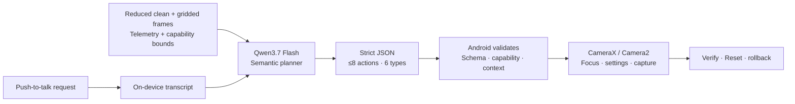

<div align="center">

# Photo Helper

### Speak in outcomes, not camera settings.

**Life Agent · AI Tinkerers × Tencent Cloud Hackathon · Team Fivecent**

[Download the Android demo](https://github.com/LuBolin/CameraAgent/releases/latest) · [Read the submission](submission.md)

</div>


Photo Helper is a voice-first camera-control agent for casual smartphone photographers, especially older adults and less-confident users. Instead of searching through camera terminology and menus, a user can describe the result they want:

> “Make it brighter, focus on the person in red, and take a photo after three seconds.”

Photo Helper turns that request into a visible, bounded plan and operates supported controls on a real Android camera. The user reviews important changes, confirms the focus target, and can restore the original camera state with one Reset.

## Why it matters

People think in outcomes—“too dark,” “too warm,” “too far away,” or “not focused on Mum.” Cameras expose exposure compensation, zoom ratios, white-balance modes, focus regions, and timers.

Photo Helper bridges that gap before the moment is lost. It is not an autonomous photographer or beauty filter; it is a safe translation layer between ordinary language and controls already available on the phone.

## What the demo does

1. The user taps **Mic**, speaks one compound request, and taps the square **Stop** control.
2. Photo Helper transcribes the finite utterance on-device where supported.
3. Qwen3.7 Flash interprets the request, current scene, and camera context as a constrained semantic plan.
4. Android rejects invalid, unsupported, or stale actions before showing the plan.
5. The user applies the setting change and confirms the visible focus target.
6. Photo Helper focuses, counts down, captures the photo, and keeps Reset available.

If hosted AI is unavailable, the plan fails closed while ordinary capture, manual tap-to-focus, limited local wording, and valid Reset behavior remain available.

## Agent architecture



Photo Helper is an agent rather than a camera chatbot because it closes an **observe → understand → plan → approve → act → verify or recover** loop against physical hardware.

The model may propose only six action types:

`ADJUST` · `SET_CAMERA` · `SET_FLASH` · `FOCUS_CELL` · `RESET` · `CAPTURE`

Qwen never receives a camera-control interface. Android reparses the full response, checks it against the active lens and current session, maps semantic directions to supported device values, and remains the sole authority that acts on the camera. Setting changes run transactionally: failure restores the pre-Apply state, and Reset restores the original baseline across chained adjustments.

## Safety and privacy boundaries

- Voice is push-to-talk, limited to 15 seconds, overwritten after use, and never sent to Alibaba Cloud.
- Hosted interpretation receives the transcript and reduced request stills—not continuous preview video or the saved full-resolution photo.
- Unsupported controls are reported rather than simulated.
- Plans tied to an old frame, lens, session, or capture cannot execute.
- The private-demo API key is encrypted with Android Keystore and can be cleared in Settings.
- A production version would place provider credentials behind a product-owned backend.

## How WorkBuddy contributed

WorkBuddy was used as a product-quality pipeline after the core app worked—not as a one-shot generator.

- **HY3** handled repository-scale investigation, implementation, Gradle checks, APK installation, and physical-device verification.
- **Kimi-K3 + the UI/UX expert** reviewed focused interaction decisions as a second pair of eyes.
- Human approval separated each stage; suggestions that conflicted with the voice-first product were rejected.
- The process changed the shipped experience: listening guidance now matches the square Stop control, and Reset remains visible while an adjustment can still be reversed.
- The final behavior was reverified through a deterministic 57/57 instrumented-test run on a physical OnePlus.

The main lesson was simple: give each agent a bounded role and require code, tests, or device evidence before accepting its conclusions.

## Try the Android demo

### Requirements

- Android 12 or later (API 31+)
- Camera and microphone permissions
- Optional: an Alibaba Cloud Model Studio (Bailian) API key with access to Qwen3.7 Flash

### Install

1. Download the APK from [GitHub Releases](https://github.com/LuBolin/CameraAgent/releases/latest).
2. On the Android device, allow the browser or file manager to install unknown apps.
3. Open the APK and confirm installation.
4. Launch Photo Helper and grant Camera and Microphone permissions.
5. To enable hosted interpretation, enter your own Bailian key in **Settings → Test, save & enable**.

The downloadable hackathon artifact is a debug-signed demonstration build, not a production Play Store release. Never publish or share a personal provider key.

## Build from source

Requirements: JDK 17 and Android SDK 34.

```powershell
.\gradlew.bat testDebugUnitTest lintDebug assembleDebug
```

The installable APK is written to:

```text
app/build/outputs/apk/debug/app-debug.apk
```

Run the connected-device suite with an API 31+ device or emulator:

```powershell
.\gradlew.bat connectedDebugAndroidTest
```

## Verification

The current build has been exercised through JVM tests, Android lint, emulator integration tests, and deterministic checks on a physical OnePlus. Coverage includes strict plan parsing, stale-context rejection, rollback and Reset, focus confirmation, countdown capture, encrypted key storage, voice-buffer handling, large text, and portrait/landscape layouts.

The hosted model remains optional and network-dependent. These checks demonstrate bounded camera behavior and recovery; they do not claim that AI produces better photographs or that the current product hypothesis has completed user validation.

## Known boundaries

- The current prompt and response contract support Qwen3.7 Flash only.
- Direct client-side provider credentials are suitable only for this private demo; production needs a backend credential boundary.
- On-device speech recognition availability varies by Android device and installed recognition provider.
- ISO and shutter time are observe-only in this version.
- Visual focus depends on model interpretation and always requires a visible user confirmation.

## Team Fivecent

- Lu Bolin
- Ethan Yap
- Nathanael Leong
