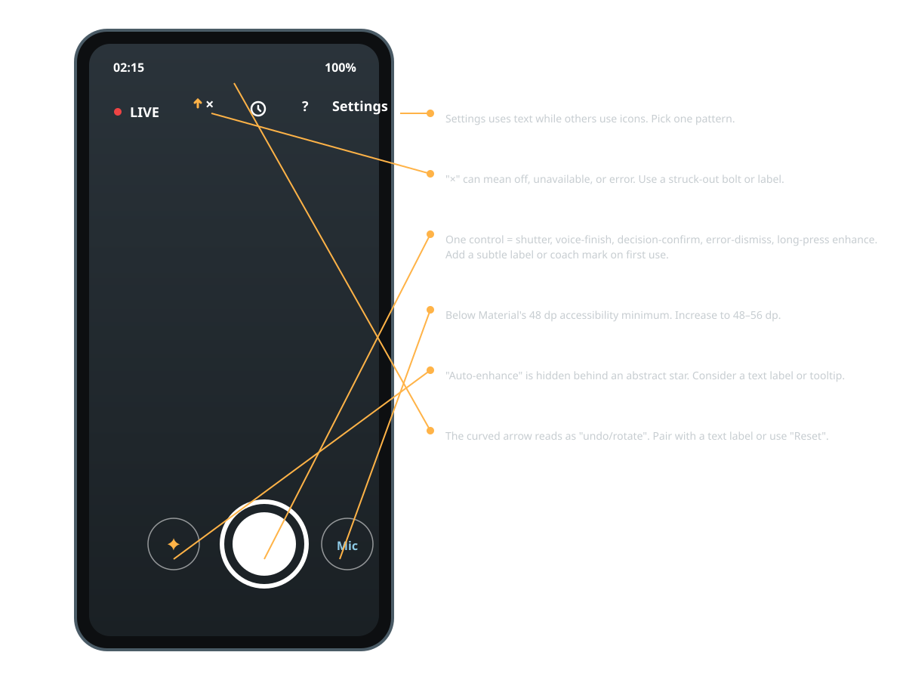
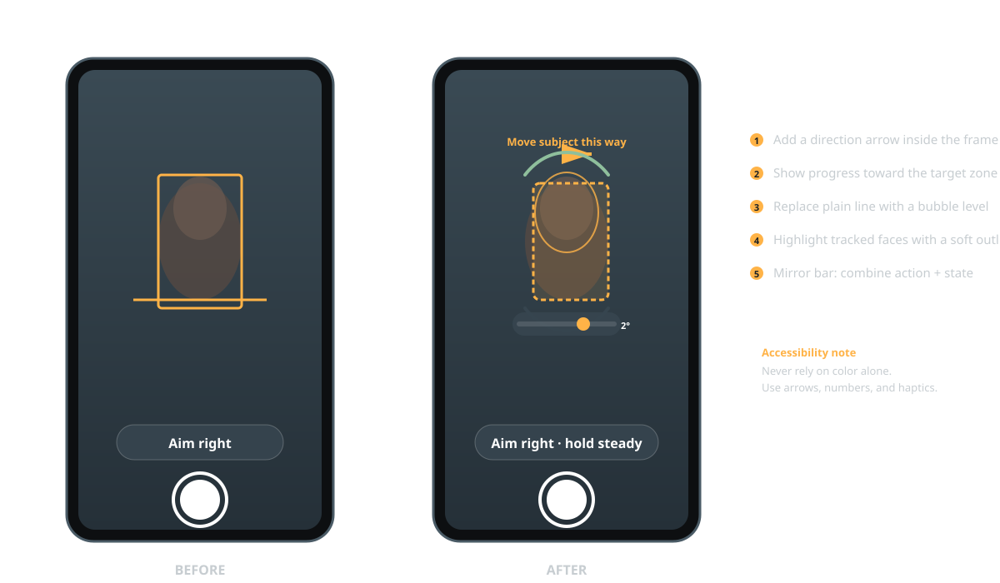
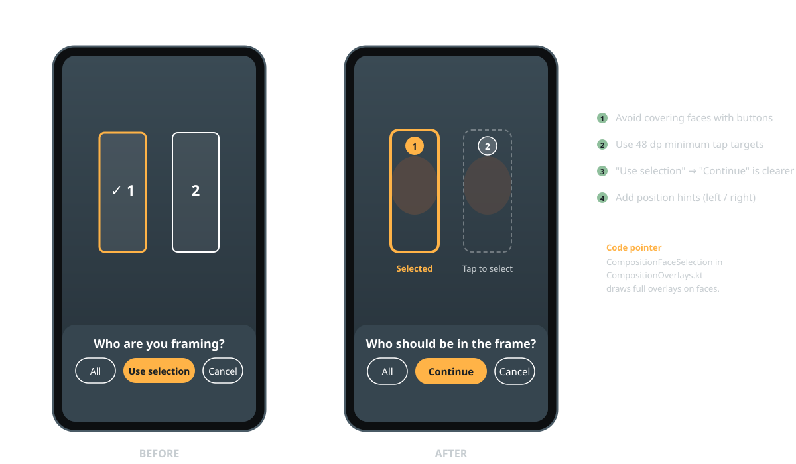
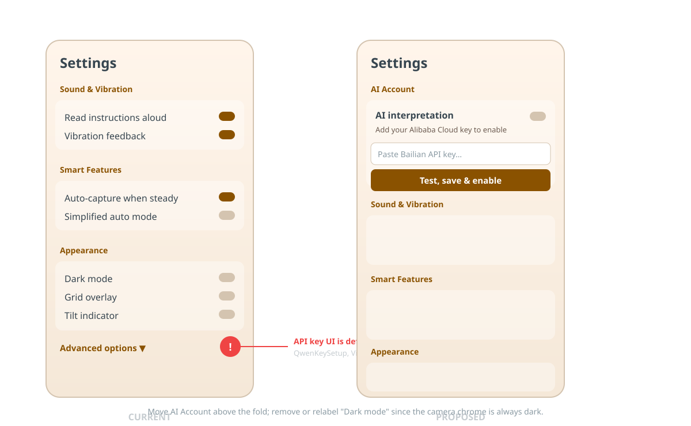
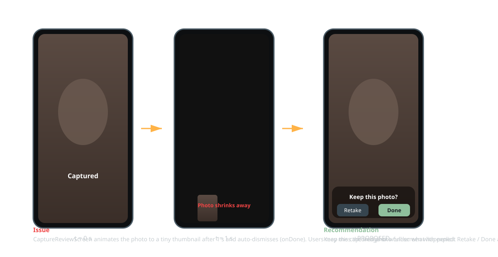
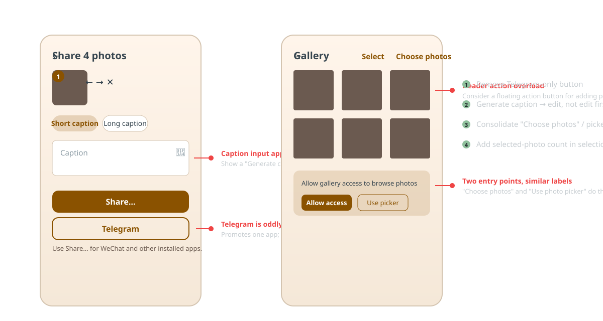

# Photo Helper — UI/UX Review

**Scope:** Android app (`com.bolin.photohelper`), Jetpack Compose, CameraX camera flow, settings, gallery/share, and guide screens.  
**Reviewed files:** `PhotoHelperTheme.kt`, `CaptureScreen.kt`, `CameraChrome.kt`, `HelperOrb.kt`, `CaptureBarComponents.kt`, `CoachingCard.kt`, `CompositionOverlays.kt`, `SettingsSheet.kt`, `LandingScreen.kt`, `CaptureReviewScreen.kt`, `MirrorBar.kt`, `PhotoWorkflowScreen.kt`, `GuideScreen.kt`, `ExerciseOverlay.kt`, plus screenshots in `current-ui.png`, `polished-ui.png`, `outputs/qa/composition-ui/`, and `outputs/gallery-ux-emulator/`.

---

## TL;DR — Highest-impact fixes

1. **API-key setup is unreachable** in Settings. `QwenKeySetup`, `VisualProviderChooser`, and `StyleProfileField` are defined but never invoked inside `SettingsSheet`.
2. **Capture review auto-dismisses** the full-screen photo after 1 s and shrinks it to a thumbnail, which feels like the photo disappeared.
3. **Composition overlays communicate direction poorly** — only a rectangle and a line are drawn; users can't see which way to move or how close they are.
4. **Person-selection buttons cover faces** and use small numbered labels.
5. **Camera chrome mixes icons and text** and overloads the single Orb with too many meanings.
6. **Mic button is 44 dp**, below the 48 dp accessibility minimum.
7. **Share screen has a Telegram-only button** and shows the caption field before any caption exists.

---

## What is already working well

- **Voice-first hierarchy is clear.** The MirrorBar keeps instruction text in one place and the viewfinder stays clean.
- **Color system is thoughtful.** `OverlayColors` is charcoal-based in both themes because the camera viewfinder is always dark. Mango is reserved for accents and is only used over known dark grounds.
- **Accessibility scaffolding is present.** `LocalReducedMotion`, live regions, semantic traversal indices, and `heading()` semantics are consistently applied.
- **Typography respects the target audience.** 16 sp floor, Quicksand for display, system font for body, Medium weight minimum.
- **Loading / processing states are branded.** The `HelperOrb` color maps to confidence via the Jarvis gradient, and the CameraX binding splash replaces a generic spinner.
- **Decision cards are restrained.** `DecisionSurface` only appears when the agent genuinely needs input; status lives in the MirrorBar.

---

## 1. Camera chrome & control hierarchy

### Issues

| # | Issue | Evidence | Impact |
|---|-------|----------|--------|
| 1a | **Mixed iconography + text in top chrome.** `current-ui.png` shows icons on the left and a text "Settings" label on the right. | `CameraChrome.kt`, `current-ui.png` | Looks unfinished; hurts scanability. |
| 1b | **Flash glyph is ambiguous.** A lightning bolt plus `×` can mean off, unavailable, or error. | `CameraChrome.kt:234-252` | Older users may misread state. |
| 1c | **Orb is overloaded.** Tap = shutter / voice-finish / decision-confirm / error-dismiss; long-press = auto-enhance. | `HelperOrb.kt`, `CaptureScreen.kt:298-307` | Discoverability is very low. |
| 1d | **Mic button target is 44 dp.** | `CaptureBarComponents.kt:36-37` | Below Material accessibility minimum (48 dp). |
| 1e | **Sparkle icon lacks a label.** Auto-enhance is hidden behind `Icons.Rounded.AutoAwesome`. | `CaptureBarComponents.kt:54-74` | Users won't know what it does. |
| 1f | **Reset icon reads as "undo/rotate"** and has no label in the top chrome. | `CameraChrome.kt` (reset icon in top row), `current-ui.png` | Affordance is weak. |

### Recommendations

- **Unify top chrome to icons only**, with text labels available via content descriptions and tooltips on long-press.
- **Replace flash `×` with a struck-out bolt icon** or a small "Off" label that appears on focus/press.
- **Add a first-use coach mark** for the Orb: "Tap to take a photo. Hold for auto-enhance." Dismiss after first tap/long-press.
- **Increase `MicrophoneButton` to 48 dp** and give `AutoEnhanceButton` a tooltip or a one-time snackbar: "This button improves the photo automatically."
- **Label the reset control** explicitly as "Reset" in a pill or use a more conventional reset/refresh glyph plus label.

---

## 2. Composition guidance overlays

### Issues

`GuidanceTarget` in `CompositionOverlays.kt:40-68` currently draws:

- A Mango rectangle for `FacePosition` / `GroupPosition` targets.
- A single horizontal Mango line for `Level`.
- Mango rectangles around tracked faces.

This tells the user *where* the target is but not:

- Which direction to move.
- How close they are to the target.
- Whether the guidance is paused.
- What the level line represents.

The screenshots in `outputs/qa/composition-ui/01-active-guidance.png` show "Aim right" in the MirrorBar with only a horizontal line in the preview, which does not reinforce the instruction.

### Recommendations

- **Add a directional arrow** from the current subject toward the target zone.
- **Show a progress ring or proximity meter** around the subject so users can see they are getting closer.
- **Replace the plain level line with a bubble-level metaphor**: a horizontal bar with a rolling indicator and a numeric degree readout.
- **Highlight tracked faces with a soft outline** rather than a solid rectangle, so faces remain visible.
- **MirrorBar copy should pair action + state**, e.g. "Aim right · hold steady" instead of just "Aim right".
- **Paused guidance should desaturate the overlay** and show "Hold on, looking for faces…".

---

## 3. Person selection for group composition

### Issues

`CompositionFaceSelection` in `CompositionOverlays.kt:164-189` draws `OutlinedButton`s directly over each detected face. Problems:

- The button covers the face it represents.
- Numbers (`1`, `2`) are small and abstract.
- "Use selection" is less clear than "Continue".
- There are no position hints (left / right) for users who may struggle to map numbers to people.

The QA screenshot `02-person-selection.png` shows two tall rectangles completely hiding the silhouettes behind them.

### Recommendations

- **Draw open outlines around faces** instead of filled/overlaid buttons.
- **Place numbered badges near each face** without obscuring it.
- **Add micro-labels** like "Person 1, left" / "Person 2, right" for clarity.
- **Use 48 dp minimum tap targets** for each selectable face region.
- **Change primary CTA to "Continue"** and disable it until at least one face is selected.

---

## 4. Settings sheet

### Critical bug: API-key setup is unreachable

`SettingsSheet.kt` defines three composables that are **never invoked** inside the sheet:

- `VisualProviderChooser` (line 262)
- `StyleProfileField` (line 301)
- `QwenKeySetup` (line 315)

The callbacks `onApiKeyChanged`, `onTestKey`, `onClearKey`, `onStyleProfileChanged`, and `onOpenVisualAiPolicy` are passed into `SettingsSheet` but not wired to any UI. The only visible AI-related control is the "AI interpretation" toggle under "Advanced options". Users who download the app cannot enter a Bailian API key through the UI.

### Other issues

- **"Dark mode" is misleading** because the camera viewfinder is always dark and chrome uses `OverlayColors`. The toggle only affects Settings, Gallery, and Guide.
- **"AI interpretation" is buried under Advanced**, even though it is required for the headline voice-control feature.
- **"AI caption consent" appears even when no key is configured**, which is confusing.

### Recommendations

- **Create an "AI Account" group at the top of Settings** containing the provider chooser, key input, test/save button, and privacy link. Hide or disable it only when no key is present.
- **Remove or rename "Dark mode"** to "Light menus" or move it under Appearance with an explanation.
- **Disable "AI interpretation" and "AI caption consent"** until a valid key is saved, with an inline message pointing to the key setup.
- **Use the existing `QwenKeySetup` composable** inside the new group; it already has the correct paste/visibility/test/clear flow.

---

## 5. Capture review flow

### Issue

`CaptureReviewScreen.kt:91-103` animates the captured photo from full-screen to a 14 % thumbnail at the bottom after a 1 s delay and then calls `onDone()`. The effect is that the photo the user just took appears to vanish. There is no explicit "Keep" or "Retake" action in the first moment.

### Recommendations

- **Keep the captured photo full-screen** and present clear actions: **Retake** and **Done** (or **Keep**).
- **Only shrink to a thumbnail after the user taps Done**, and even then keep a clear path back to the full image.
- **Show a "Captured" pill for a shorter duration** (≈ 0.5 s) or combine it with the action bar so it does not block the photo.

---

## 6. Gallery & share screens

### Issues

| # | Issue | Evidence |
|---|-------|----------|
| 6a | **Two overlapping entry points:** "Choose photos" in the header and "Use photo picker" in the banner do the same thing. | `PhotoWorkflowScreen.kt:151-159`, `162-199` |
| 6b | **Telegram is promoted as a primary share target.** A generic camera app should not hard-code one messenger. | `PhotoWorkflowScreen.kt:793-808` |
| 6c | **Caption input appears before a caption exists.** The empty field invites the user to type before they know AI can generate text. | `PhotoWorkflowScreen.kt:858-874` |
| 6d | **"Caption feedback" is visible only after generation**, which is good, but the layout still looks like two empty text boxes on first open. | `PhotoWorkflowScreen.kt:876-891` |
| 6e | **Viewer supports pinch/pan but not adjacent-photo browsing.** `ZoomableImage` has no pager or next/previous affordance. | `PhotoWorkflowScreen.kt:355-380`, `1027-1060` |
| 6f | **Gallery pagination is manual.** "Load more" is valid for small libraries, but becomes an avoidable extra step as the library grows. | `PhotoWorkflowScreen.kt:313-328` |

### Recommendations

- **Consolidate photo-adding** into one "Add photos" action or a single "Use system picker" action.
- **Remove the Telegram button** or replace it with a generic "More apps" overflow that includes recently-used apps.
- **Reorder the caption flow:**
  1. Show the photo strip.
  2. Show a prominent **"Generate caption"** CTA.
  3. After generation, reveal the editable caption field and a **"Revise"** button.
- **Use a clearer empty state** for the gallery when access is denied; the current banner has two competing CTAs.
- **Keep manual pagination for now if you want a conservative implementation**, but trigger `loadMore()` when the last grid row becomes visible once the library is large enough; retain a visible retry/load affordance for failures.

---

## 7. Landing, guide, and onboarding

### Strengths

- `LandingScreen.kt` uses a fixed blurred background and a clear "Tap to start" Orb. The animation is staggered and respects reduced motion.
- `GuideScreen.kt` is well-structured with modules, lessons, progress rings, and quick-start actions.
- `ExerciseOverlay.kt` provides contextual coaching without leaving the camera.

### Issues

- **The Quick Start card pulses infinitely**, which can be distracting for users sensitive to motion.
- **"Tap to start" does not explain *what* the app does.** The tagline "The photo your moment deserved" is poetic but vague.
- **Guide module list has no search or filtering** once the user has completed lessons.

### Recommendations

- **Stop the Quick Start pulse after 3 cycles** or respect reduced motion by removing it entirely.
- **Add a one-line value prop under the title:** e.g. "Say what you want — 'make it brighter' — and Photo Helper does the rest."
- **Allow completed modules to be collapsed** so the list stays scannable.

---

## 8. Accessibility & touch targets

| Element | Current | Recommended | File |
|---------|---------|-------------|------|
| Mic button | 44 dp | 48–56 dp | `CaptureBarComponents.kt` |
| Auto-enhance button | 44 dp | 48–56 dp | `CaptureBarComponents.kt` |
| Face selection chips | variable, can be small | 48 dp min | `CompositionOverlays.kt` |
| Settings toggle rows | 56 dp min | keep | `SettingsSheet.kt` |
| Decision card buttons | 56 dp min | keep | `CoachingCard.kt` |

- **Voice hints in the MirrorBar** (`MirrorBar.kt:126-131`) cycle every 5 s. Add a small "Try saying…" prefix or a static hint indicator so users understand these are examples, not commands.
- **Countdown overlay** (`CameraChrome.kt:212-228`) is good but should also announce the number via TalkBack live region.
- **Focus target** (`CameraChrome.kt:319-375`) is 72 dp and uses a shadow + Mango stroke; keep it, but consider a brief haptic pulse when focus locks.

---

## 9. Color, motion, and brand consistency

- **Mango (`#FFB347`) on light cream is ~1.6:1** — the theme already handles this by using `MangoDeep` for text on light surfaces. Verify no Mango text appears on cream.
- **The Jarvis gradient is a nice brand signature** for the Orb. Make sure it is not used for error states; errors should use the dedicated error red.
- **Animation budget is reasonable** (`MotionTokens` are 150–800 ms). Ensure all `AnimatedVisibility` and `animate*AsState` calls check `LocalReducedMotion.current` — most already do.
- **Avoid animating the photo away in review**; motion should clarify, not remove the user's just-captured image.

---

## 10. Recommended priority order

| Priority | Item | Why |
|----------|------|-----|
| **P0** | Wire up `QwenKeySetup` in Settings | Core feature is unreachable. |
| **P0** | Fix capture review auto-dismiss | Users lose confidence in the camera. |
| **P1** | Improve composition overlays with direction + progress | Headline feature for composition guidance. |
| **P1** | Redesign person selection | Blocks group-shot workflow. |
| **P1** | Increase Mic / Auto-enhance touch targets | Accessibility compliance. |
| **P2** | Unify camera chrome icons and labels | Polish and perceived quality. |
| **P2** | Rebalance the bottom control row (12b) | Removes crowding; puts flash in thumb reach. |
| **P2** | Reduce MirrorBar / ReviewPill type scale (12a) | Stops transient status out-shouting decision cards. |
| **P2** | Clean up gallery/share CTAs | Reduces confusion in secondary flows. |
| **P3** | Refine landing/guide motion | Minor but worthwhile polish. |

---

## 11. Validated implementation notes from the continuation pass

- `ThemeMode.SYSTEM` is supported by `PhotoHelperTheme` and is passed from `MainActivity`, but the Settings UI only exposes a binary Dark mode switch. The state model and persistence are ready for a three-option control; this is a UI gap, not a missing theme implementation.
- The API-key callbacks are wired from `MainActivity` into `SettingsSheet`, but the corresponding setup composables are not rendered. This makes the issue especially actionable: the missing work is composition/wiring, not a new API-key flow.
- `CaptureReview` intentionally keeps CameraX bound, but its `LaunchedEffect` waits 1 second, animates the photo to a 14% thumbnail, and calls `onDone()`. Make the review persistent until an explicit user action; preserve the current CameraX reuse optimization.
- `ViewerScreen` uses `ZoomableImage` for pinch/pan, so a pager should coordinate with zoom state rather than replace the current gesture handling outright. Disable horizontal paging while scale is above 1x.
- The share screen already has a good progressive disclosure pattern for caption feedback. Preserve that pattern while making caption generation explicit and keeping the generic Android share flow primary.
- No source files were modified in this review pass; the recommendations are intentionally implementation-ready but non-invasive.

---

## 12. Additional findings (type scale and control layout)

### 12a. MirrorBar and ReviewPill use `headlineSmall` (22 sp) for transient status text

`MirrorBar.kt:90` and `CaptureReviewScreen.kt:308` both set `style = MaterialTheme.typography.headlineSmall`, which this app defines as Quicksand 22 sp / SemiBold — the largest style below `display*`. It is applied to short, ephemeral strings such as "Listening…", "Working on it…", and "Captured".

Consequences:

- The pill grows wider than the phrase warrants. `MirrorBar` already caps at `widthIn(max = 360.dp)` and `maxLines = 3`, so longer coaching lines wrap into a block that covers a meaningful slice of the viewfinder.
- Hierarchy inverts: the decision cards use `titleSmall` (18 sp), so transient status renders louder than the content the user is actually meant to act on.

Recommendation: drop the pill to `bodyLarge` (20 sp / Medium) or `titleSmall` (18 sp / SemiBold). Both remain above the app's own 16 sp accessibility floor, so there is no readability cost. Reserve `headlineSmall` for a single, genuinely important message.

### 12b. Bottom control row uses three equal-weight columns, but the content is not equal

`CaptureScreen.kt:395-439` lays the bottom row out as three `Box(Modifier.weight(1f))` columns:

| Column | Content | Rendered width |
|--------|---------|----------------|
| Left | Gallery button | 56 dp |
| Centre | `HelperOrb` | 72 dp + 2 × 10 dp glow margin = 92 dp |
| Right | `MicrophoneButton` + `AutoEnhanceButton` | 44 + 8 + 44 = 96 dp |

On a 360 dp-wide screen each column receives roughly 109 dp after the 16 dp horizontal padding. The right-hand pair therefore leaves only ~13 dp of slack and sits visually heavier than the single gallery button on the left, even though all three columns claim equal width. The Orb stays screen-centred (its column is the middle one), but the row reads as unbalanced and the right-hand pair is cramped against its column edge.

Recommendation: give the Orb a larger share of the row and promote the two right-hand controls into their own columns — e.g. `1f | 1f | 1.5f | 1f | 1f` for gallery, mic, Orb, enhance, and a fifth slot (flash or overflow). This equalises spacing, removes the crowding, and puts the two most-used actions at symmetric thumb distance from the Orb. It also gives the flash control a thumb-reachable home instead of the top bar.

## Appendix: code pointers

- Theme & color tokens: `app/src/main/java/com/bolin/photohelper/ui/PhotoHelperTheme.kt`
- Camera screen & state machine: `app/src/main/java/com/bolin/photohelper/capture/CaptureScreen.kt`, `CaptureUiState.kt`
- Camera chrome & overlays: `app/src/main/java/com/bolin/photohelper/capture/CameraChrome.kt`, `CompositionOverlays.kt`
- Orb & voice bar: `app/src/main/java/com/bolin/photohelper/capture/HelperOrb.kt`, `CaptureBarComponents.kt`, `MirrorBar.kt`
- Decision cards: `app/src/main/java/com/bolin/photohelper/capture/CoachingCard.kt`
- Settings: `app/src/main/java/com/bolin/photohelper/capture/SettingsSheet.kt`
- Review: `app/src/main/java/com/bolin/photohelper/capture/CaptureReviewScreen.kt`
- Gallery/share: `app/src/main/java/com/bolin/photohelper/gallery/PhotoWorkflowScreen.kt`
- Guide: `app/src/main/java/com/bolin/photohelper/guide/GuideScreen.kt`, `ExerciseOverlay.kt`
