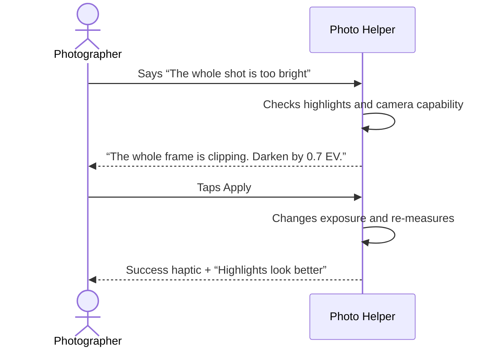
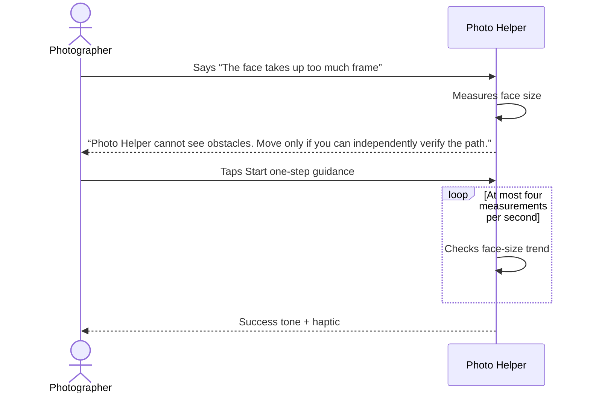

# Photo Helper — Android Product and Interaction Design

Status: implementation-ready draft  
Last reviewed: 2026-08-04
Audience: product design, engineering, user research, accessibility review, and hackathon judges

Companion document: [Android Technical Architecture](ANDROID_TECHNICAL_ARCHITECTURE.md)

## 1. Product proposition

Photo Helper is a camera that lets someone describe what feels wrong with the current shot in ordinary language. It turns the complaint into either:

1. a concrete, one-tap camera change; or
2. one short positional instruction that it monitors until completed.

The promise is not “AI makes every photo beautiful.” The promise is:

> Tell the camera what bothers you. It will suggest one bounded, reversible setting change or one explicitly started guidance action, then check what happened.

The planned hackathon artifact is one private, single-device Android app. Android on-device speech and face/frame analysis feed a deterministic local planner. For two visually ambiguous complaint families, the app may send one reduced current frame directly to Z.AI `glm-4.6v-flash`; Z.AI returns only a fixed semantic hint. The app—not the model—chooses, validates, applies, and verifies every camera action. This qualifies as a bounded agent through its observe–propose–act–verify loop, not through a chat persona.

## 2. Experience principles

### User intent is the objective

The app should not impose a universal beauty or composition score. “Too dark” means the user wants a brighter result even if the camera considers the exposure technically correct.

A complaint can be either a preference or a diagnosis. When evidence supports a defect, the app may say what it observed and verify that metric. When evidence does not support a defect, it says so without overriding the photographer: “Exposure is in the normal range, but I can brighten it.” It then verifies that the requested effect occurred and asks whether it is closer—not whether the image is objectively fixed.

### One correction at a time

Photography is time-sensitive. Give one primary action, one reason, and one obvious next step. Do not respond with a tutorial or a list of ISO, shutter, white balance, distance, and angle changes simultaneously.

### Show the consequence before jargon

Prefer “Darken by 0.7 EV to reduce clipping across the photo” over “ISO 50, 1/500 s.” Technical values remain visible in a secondary line for interested users.

### Approval before camera control

The user taps Apply before a setting changes and Start guidance before the app begins spoken movement instructions. Reset remains visible while its baseline still belongs to the current camera session; session invalidation clears overrides instead of restoring stale values.

### Verify instead of pretending certainty

After an action, report observable progress: “The highlights are no longer clipping” or “Your face now fills less of the frame.” If the app cannot measure success, it says so.

### Voice augments, never replaces, the screen

Every spoken instruction has matching text. Every voice-input flow has typed input. Important success and warning states also use haptics or an earcon.

## 3. Target users and jobs

### Primary: casual portrait photographer

Situation: taking a photo of a friend, partner, or family member.  
Job: correct an obvious problem without understanding manual photography.

Examples:

- “Her face looks huge.”
- “The window is too bright.”
- “He looks short.”
- “Why is everything so blue?”

### Secondary: blind or low-vision photographer

Situation: visual framing is difficult or unavailable.  
Job: hear where the subject is, how to move the phone, and when the target composition is reached.

### Not the MVP audience

- Professional photographers seeking a complete manual camera.
- Users capturing sports, wildlife, or fast candid moments.
- Users expecting beauty retouching or generative editing.
- Large group photography.
- Solo creators using a tripod or propped-up phone. Hands-free subject-body instructions and actor switching are future work, not an MVP target.

## 4. Core scenarios

### Scenario A — apply a setting



### Scenario B — guide a position



### Scenario C — clarify ambiguity

User: “They look weird.”  
App: “Is the problem their size in the frame, the angle, or the color?”  
UI: three large chips: `Size`, `Angle`, `Color`.

Do not guess an executable action from a vague complaint.

### Scenario D — comment after capture

The captured image remains on screen with a Retake action.

User: “The whole shot is too dark.”  
App: “Brighten by 0.7 EV for the retake.”  
Primary button: `Apply for retake`  
Secondary actions: `Retake`, `Done`

The wording must not imply that the existing image is being edited.

The photo has already been saved when review appears, and review explicitly says `Original remains saved`. `Done` dismisses review; `Retake` returns to the live camera without changing settings. Neither duplicates or deletes the saved original. The camera stays ready behind the review, while live analysis and the shutter pause. Post-capture diagnosis uses a downscaled decode of the actual saved pixels plus available capture metadata, never the last preview frame. Apply revalidates the active camera, returns to live preview with `Retake settings active`, and checks the new frame. If the lens changed, the app recalculates before enabling Apply.

### Scenario E — bounded Z.AI visual interpretation

This path runs only when `Visual AI enabled` is on and a tested demo key is configured. It applies only to whole-frame color-cast ambiguity or one stable face whose size-versus-perspective meaning is ambiguous. Novel wording, `person looks short`, exposure, blur, and ordinary positioning stay local.

After an eligible final comment, the app freezes the newest qualifying live frame—or decodes the saved photo in Capture Review—then produces one metadata-free Observation Image. A compact non-modal state appears:

```text
┌──────────────────────────────────┐
│ Checking current frame with Z.AI…│
│ Local choices remain available. │
│                         [Cancel] │
└──────────────────────────────────┘
```

The app sends that single reduced image and the bounded family prompt directly to Z.AI. It does not stream preview frames. A new Complaint, shutter, Back, backgrounding, Cancel, timeout, or process death releases the in-memory image and stops local waiting. If transmission has already started, cancellation cannot recall data already received by Z.AI.

The result never appears as model prose. It may choose only one reviewed, family-specific Visual Hint. The app rejects malformed, stale, family-conflicting, or polarity-conflicting output, rechecks the current scene and camera capabilities locally, and then either presents a normal local recommendation or keeps the same clarification chips. Color exposes Apply only with fresh matching evidence and tested white-balance control; face occupancy may expose one-step guidance; close-perspective interpretation is advice only.

Every accepted result carries `AI-interpreted by Z.AI; camera controls checked on device`. Missing key, invalid key, no network, timeout, or model failure never blocks local coaching.

## 5. Information architecture

The MVP has one destination: Capture. Settings appear as a modal sheet; there is no bottom navigation.

```text
Capture
├── Camera preview
├── Guidance overlay
├── Agent response card
├── Comment composer
├── Shutter
└── Settings sheet
    ├── Spoken guidance on/off
    ├── Haptics on/off
    ├── Coaching detail: simple / technical
    ├── Visual AI enabled on/off
    ├── Z.AI API key (masked)
    │   ├── Test key
    │   └── Clear key
    └── Demo data explanation
```

Captured-photo review is an overlay state of Capture, not a second navigation destination.

## 6. Capture screen

### Portrait layout

```text
┌──────────────────────────────────┐
│               LIVE       Settings│
│                                  │
│                                  │
│          camera preview          │
│       ┌──────────────────┐       │
│       │ subject overlay  │       │
│       └──────────────────┘       │
│                                  │
│       “Aim the phone right”       │
│            [Cancel]              │
├──────────────────────────────────┤
│ Agent response / action card     │
│ “Darken 0.7 EV”        [Apply]   │
├──────────────────────────────────┤
│ [ What looks wrong?          ][🎙]│
│             [ Shutter ]           │
└──────────────────────────────────┘
```

### Landscape layout

- Preview remains dominant.
- Shutter moves to the right edge.
- The agent card occupies the lower-left safe area.
- The comment composer never covers the subject center.
- Spoken guidance becomes more important; no separate landscape feature set is introduced.

### Control priority

1. Shutter is always visible. It is enabled while the camera is ready except during the brief Apply acknowledgement; capture cancels listening, interpretation, a visible recommendation, or active guidance.
2. Cancel guidance is always visible during guidance.
3. Apply/Start guidance is the only filled action in the response card.
4. Reset appears immediately after a non-automatic camera setting is applied and remains enabled only while its camera-session baseline is valid.
5. Settings remains secondary.

## 7. Interaction states and UI copy

| State | Visual treatment | Default copy |
|---|---|---|
| Previewing | unobstructed preview | placeholder: “What looks wrong?” |
| Listening | microphone pulse and transcript | “Listening…” |
| Interpreting locally | subtle progress under composer | “Checking the shot…” |
| Requesting Z.AI interpretation | compact network indicator; local chips remain usable | “Checking current frame with Z.AI…” |
| Recommendation | bottom card with one action | action-specific |
| Applying | Apply button disabled briefly | “Applying…” |
| Guiding | instruction centered near lower preview | direction-specific |
| Success | green check, short haptic/earcon | “That matches your request” |
| Ambiguous wording | clarification chips | “Which part feels wrong?” |
| Offline fallback | no blocking dialog | “Offline—using basic coaching” |
| Camera control unsupported | explanation, no disabled mystery button | “This phone cannot apply manual shutter here” |
| No face | outline absent | “Point the camera at the person first” |

Avoid “AI is thinking,” “perfect,” “ideal composition,” and “you took a bad photo.”

For preference-based actions, `That matches your request` means the requested direction was measurably applied; the follow-up is `Is this closer?`. It must not reuse diagnosis copy such as `Highlights are fixed` unless defect evidence existed before the action.

## 8. Recommendation card

Each card contains at most:

1. a short diagnosis;
2. one proposed action;
3. one sentence explaining the consequence;
4. one primary button;
5. optional Reset or Dismiss.

A card derived from an accepted Visual Hint carries the persistent provenance label `AI-interpreted by Z.AI; camera controls checked on device`. It remains visible after the transient network indicator disappears and TalkBack announces it after the card headline. Local-only cards omit it. The label does not imply that the model selected or applied camera controls.

### Setting example

```text
The whole frame is overexposed
Darken by 0.7 EV
This should reduce clipping across the photo.

[Apply]                         Dismiss
```

Technical detail mode adds:

```text
Current: EV 0 · ISO 320 · 1/120 s
After:   EV −0.7 · exposure remains automatic
```

### Positional example

```text
The face fills 48% of the frame
If you can independently verify a clear path, take one small step back
I’ll tell you when the framing reaches about 35%.

[Start one-step guidance]       Dismiss
```

### Tradeoff example

```text
The image looks noisy
Lower ISO only if the subject can stay still.
A slower shutter may introduce blur.

[Use lower ISO]                 Keep current
```

The app must expose a tradeoff before applying an action that may exchange noise for blur or vice versa.

## 9. Conversation design

### Response formula

```text
[What the app observed] + [one action] + [expected effect]
```

Examples:

| User comment | Good response | Avoid |
|---|---|---|
| “The whole shot is too bright” | “The frame is clipping. Darken by 0.7 EV?” | “Try lowering ISO, raising shutter, changing metering, or moving.” |
| “The background is too bright” | “Do you mean the whole photo, the person, or only the background?” | Claiming global EV fixes the background without affecting the person |
| “Looks blue” | “The image trends cool. This camera can warm it—apply?” or capability-gated advice | “Set Kelvin to 6200.” without capability/evidence |
| “Face too big” | “Does it take up too much frame, or do the features look distorted?” | Assuming occupancy and perspective distortion are the same problem |
| “Person looks short” | “Do you mean their body is cropped, or the angle makes them look shorter?” | Immediately applying a distortion-heavy wide-angle change |
| “Blurry” | “Is movement blurred, or did focus miss?” with `Freeze movement` / `Focus missed` chips | “There is motion blur. Use a faster shutter.” |

### Clarification policy

Ask a clarification when:

- the complaint maps to more than one action;
- an attempted Measured Diagnosis lacks or contradicts its required evidence; a clear-direction User Preference still receives a mismatch-labeled reversible option;
- the relevant subject cannot be detected;
- the action would trade one defect for another and the preference is unknown;
- an optional visual hint is unavailable, family-disallowed, polarity-conflicted, stale, or ambiguous.

Clarifications should have two or three concrete chips. Do not ask open-ended follow-up questions repeatedly.

### One complaint, not chat

The composer says `Describe the current shot`, and the screen keeps only one response card. There is no conversation transcript. A new complete comment replaces the prior recommendation; shutter, capture completion, or camera-session change ends the Complaint lifecycle. Clarification chips may carry explicit machine context. Literal `reset` or `undo last camera adjustment` invokes the visible Reset behavior when its baseline is valid. Elliptical free text such as `a little more`, `do the opposite`, or `no, the background` cannot execute; respond with `Describe the result directly, for example “too bright” or “background too bright.”`

Regional exposure is not executable MVP scope. Background- or face-specific complaints use `Whole photo`, `Person/face`, and `Background` chips. Only `Whole photo` can produce global EV Apply; the other choices explain that a global change affects both regions.

`Face Occupancy` and `Close-Perspective Distortion` are separate. Occupancy is measured from the locked face box and can be guided. Distortion receives advice to increase distance and then restore framing with a longer focal length or zoom; the MVP does not claim to verify it.

### Tone

- Direct, calm, and non-judgmental.
- Use ordinary photographic language first and technical vocabulary second.
- Attribute uncertainty to the observation: “I can’t see the whole body,” not “You framed it incorrectly.”
- Say “matches your request,” not “perfect.”

## 10. Setting behaviors

### Exposure

Default to exposure compensation while auto-exposure remains active.

- Show signed EV, such as `−0.7 EV`.
- Preview the result immediately after Apply.
- Verification focuses on the user's complaint: reduced clipping or lifted shadows.
- Reset returns to `0 EV` unless the user had a different baseline when coaching began; retain and restore that baseline during the session.

### ISO and shutter

Show manual parameters only when the device supports and reports them reliably.

- “Freeze motion” prioritizes faster shutter and explains that ISO/noise may increase.
- “Reduce noise” prioritizes lower ISO and explains that shutter/blur may increase.
- Display both before and after values.
- Keep Reset automatic controls visible.
- If unsupported, provide advice without a fake Apply button.

### White balance

- Prefer a small warmer/cooler relative change or Reset AWB.
- Do not claim that a strongly blue subject is a color cast based only on average color.
- Show Kelvin only when the active camera has a calibrated mapping; otherwise show `Warmer`, `Cooler`, or `Auto` even in technical mode.
- Verification copy should be modest: “The neutral areas are less blue,” not “Colors are correct.”

### Zoom and lenses

Zoom is not the default response to face perspective problems.

- If the face is simply too large in the composition, step-back guidance is preferred.
- If the user declines walking or cannot independently verify the path, offer zoom-out only when the active lens supports it without an abrupt lens switch.
- Lens-switch advice is out of MVP scope.

## 11. Positional guidance behaviors

### Direction language

The rear-camera MVP instructs only the photographer and camera. It never tells the subject to move. Use actor-explicit instructions:

- “Aim the phone slightly left/right.”
- “Tilt the top of the phone toward/away from you.”
- “Raise/lower the phone.”
- “Photo Helper cannot see obstacles. Move only if you can independently verify the path.”

Avoid ambiguous “move left” when it is unclear whether the photographer or phone should move. Desired frame goals and physical guidance use separate language: placing the subject left in the image requires aiming the phone right. All verification uses normalized, unmirrored saved-image coordinates with origin at the top-left.

### Feedback layers

- Visual: target band or level line.
- Spoken: one short direction.
- Haptic: light tick as the target approaches; distinct success pulse at completion.
- Text: exact copy of the spoken direction.

### Stability and pacing

- The target must be satisfied for about 500 ms before success.
- Do not alternate left/right instructions due to single-frame noise.
- Pause speech while the subject is temporarily lost.
- After ten seconds without progress, offer `Try again` and `Stop`, rather than escalating instruction frequency.

### Physical safety

- The app has no hazard detector and never claims that a path is safe.
- Every translational recommendation is opt-in. Its card says `Photo Helper cannot see obstacles. Move only if you can independently verify the path.` and requires a `Start one-step guidance` tap before asking for at most one small step, stopping, and re-measuring.
- Dismissal produces non-executable `Increase the camera-to-subject distance, then reframe` advice. A small continuous zoom-out Apply may replace it only when the active lens supports that change without switching lenses.
- When Android touch exploration is active, the MVP does not offer walking instructions. It keeps pan/tilt/level coaching and turns face-occupancy movement into distance advice that a nearby person can help carry out.
- Cancel must remain reachable with one tap and with the Android back gesture.

## 12. Onboarding and permissions

### First launch

Use two concise screens at most.

Screen 1:

```text
Tell the camera what looks wrong.
Photo Helper can adjust supported settings or guide your position.
[Continue]
```

Screen 2:

```text
You stay in control.
Nothing changes until you tap Apply or Start guidance.
Visual AI is off until you add your Z.AI demo key in Settings.
[Open camera]
```

The key-entry screen explains the actual boundary before Visual AI can be enabled: `For two visual questions, Photo Helper sends one reduced current frame and your comment directly to Z.AI. It never sends audio and does not stream the preview.`

### Permission timing

- Camera: request after `Open camera`.
- Microphone: request only after the user taps the microphone. Before first use, state: `Android transcribes voice on this device. Photo Helper does not store or send your audio.` If an installed on-device English recognizer is unavailable, keep typed English and local chips; never fall back to cloud speech.
- Internet: declare it in the installed app for direct Z.AI requests. Android does not present this as a runtime permission.

### Denial recovery

- Camera denied: explain that capture requires it and offer `Open settings`; no blank preview.
- Microphone denied: keep typed comments and show a small `Enable microphone` action in settings.
- Do not repeatedly re-prompt after denial.

## 13. Accessibility

- Every icon has a content description that states the action and current state.
- Minimum touch target: 48 dp.
- Agent card and guidance text meet WCAG AA contrast against the preview using a scrim.
- Do not encode success or direction by color alone.
- TalkBack reading order: current instruction → primary action → dismiss → composer → shutter.
- Spoken instructions can be muted independently of TalkBack.
- Captions remain visible while TTS speaks.
- Haptics can be disabled.
- The microphone button exposes listening, processing, and error states to accessibility services.
- Large font must not cover the shutter or Cancel; the response card may expand upward and scroll internally.
- Do not rely on face-recognition identity; only geometry is used.

## 14. Demo data and credential design

This is an explicit private-demo tradeoff, not a production security design.

- Visual AI is disabled until the operator enters a disposable Z.AI key, successfully tests it, and turns on `Visual AI enabled`.
- The app stores only encrypted key ciphertext and its IV in private preferences. A non-exportable Android Keystore AES/GCM key performs encryption and decryption. Android backup is disabled.
- The Settings field is masked after save and provides `Test key` and `Clear key`. The operator uses a low-quota credential and revokes it after the hackathon.
- The key is not placed in source, Android resources, `BuildConfig`, logs, analytics, screenshots, or crash reports. Before the key-entry UI exists, desktop fixture scripts read `ZAI_API_KEY` from the process environment only.
- Direct API access means the credential can still be extracted from a compromised or instrumented phone. This is accepted only because the artifact is installed on one operator-controlled device with a disposable credential. A public build would require an owned backend or a capable on-device model.
- For an eligible Complaint, the app automatically sends one reduced, metadata-free Observation Image and the bounded comment/prompt directly to Z.AI. It sends no audio, EXIF, content URI, face landmarks, tracking ID, hardware ID, or local metrics and does not stream camera frames.
- The image/JPEG/base64 exists in memory only until result, failure, cancellation, backgrounding, or process death. The app does not claim guaranteed physical-memory erasure or provider recall after sending.
- The product makes no zero-retention or guaranteed-residency claim. Z.AI documents both real-time API processing and request-content caching behavior; the demo simply discloses the provider and limits what is sent.
- About copy is exact: `This private demo uses Android on-device speech and face/frame analysis plus Z.AI GLM-4.6V-Flash for selected visual interpretation. It sends one reduced current frame for an eligible comment. Z.AI returns a fixed semantic label; camera decisions and verification stay on this phone.`

### UI indicators

- The microphone button visibly changes while listening.
- A small `Z.AI` network indicator appears only during a direct visual request; local clarification remains usable.
- Settings shows the fixed provider/model, key status, Visual AI toggle, one-frame limit, `Test key`, `Clear key`, and the current Z.AI policy link.

## 15. Error and recovery design

Errors use the smallest recovery surface that works. Do not show a modal dialog for recoverable coaching failures.

| Failure | Response |
|---|---|
| No speech recognized | Keep composer open with “I didn’t catch that” |
| Missing or invalid Z.AI key | Turn Visual AI off for the session; keep local chips and link to Settings |
| Offline or Z.AI timeout | Keep the same chips and add “Visual interpretation unavailable—using local coaching” |
| Malformed or disallowed model output | Discard it silently, keep local chips, and record a redacted diagnostic |
| Unsupported manual control | Explain, then offer closest automatic action or advice |
| Subject lost during guidance | “I lost the face—point back at the person” and pause |
| Camera adjustment rejected | Reset automatic controls and show “That setting isn’t available on this camera” |
| Capture fails | Keep preview active and offer `Try shutter again` |
| Camera unavailable | Full-screen recovery with `Retry` |

The shutter remains enabled during listening, interpretation, a visible recommendation, guidance, verification, and non-fatal errors. Pressing it cancels that coaching work before capture. It is disabled only while the camera is not ready, already capturing, reviewing a saved photo, or acknowledging Apply; shutter presses are never queued.

## 16. Visual design direction

### Character

Quiet camera utility, not chat app. The live image should dominate.

### Color

- Neutral dark chrome around the preview.
- One accent color for active listening, Apply, and guidance targets.
- Green reserved for measured completion.
- Amber for tradeoffs or uncertain advice; red only for blocking errors or safety warnings.

### Typography

- Use the system typeface and Material 3 type scale.
- Instructions use short sentence case.
- Camera parameters use tabular numerals if available.

### Motion

- Microphone pulse while listening.
- Guidance target eases rather than jumps between noisy measurements.
- Success check appears for about one second, then clears.
- Respect Android reduced-motion/accessibility settings where applicable.

No mascot, conversational bubbles, or decorative generation is needed for the MVP.

## 17. MVP content matrix

| Intent | Detection evidence | Action | Verification | MVP support |
|---|---|---|---|---|
| Too bright | highlight clipping + luma | darker EV | clipping falls | required |
| Too dark | low luma/shadows | brighter EV | shadows/luma improve | required |
| Too blue | chroma bias + scene check | capability-gated warmer WB/reset, otherwise advice | neutral bias improves when executable | required understanding; Apply is capability-gated |
| Too yellow | inverse bias | capability-gated cooler WB/reset, otherwise advice | neutral bias improves when executable | required understanding; Apply is capability-gated |
| Face too big | face-width fraction | step back after per-action opt-in; otherwise distance/zoom advice | face fraction falls | required |
| Face too small | face-width fraction | step closer after per-action opt-in; otherwise distance advice | face fraction rises | required |
| Crooked | phone roll | rotate phone | roll enters band | required |
| Subject too high/low | face/body center | aim phone | center enters band | required |
| Blurry / freeze motion | explicit `Freeze movement` choice + saved capture telemetry | faster shutter plus bounded ISO only after the five-run device gate | hardware acknowledgement, then comparable saved-photo check | optional showcase; hidden on failure |
| Person looks short | no pose-backed evidence in MVP | app-owned crop-versus-angle clarification and modest advice | user confirmation only | local advisory; never uploaded |
| Grainy | high ISO telemetry | lower ISO if safe | later captured-photo check | stretch |

The reliable judged cut is live and post-capture exposure EV (including `Apply for retake` from the saved RetakeBaseline), face-occupancy guidance, capture/review, Reset, and typed input. On-device voice/TTS is used when the installed services are available but is not a release gate. Color and phone position are locally understood; color Apply is capability-gated. Manual ISO/shutter is a showcase, not a release blocker. “Person looks short” demonstrates honest local clarification, not false certainty or remote analysis.

## 18. Evaluation plan

### Hackathon success metrics

- At least 90% of scripted MVP comments map to the intended action.
- All executable actions remain inside the active camera's reported ranges.
- Median user can complete the Apply flow in two taps after commenting.
- Positional guidance finishes without left/right oscillation in the scripted setup.
- Missing key, airplane mode, or Z.AI failure leaves the core local experience usable; color may be advisory on a camera without stable WB controls.

### Small usability test

Recruit five to eight people unfamiliar with manual camera controls. Give each person four tasks without explaining the UI:

1. Fix a uniformly overexposed portrait.
2. Make a face smaller in the frame.
3. Straighten the phone using visible guidance and spoken guidance when available.
4. Recover when the app misunderstands “They look weird.”

Measure:

- task completion;
- time from comment to accepted shot;
- number of repeated or contradictory instructions;
- whether users understand Apply versus editing the old photo;
- perceived trust before and after verification;
- preference between spoken, visual, and combined guidance.

Ask one final forced comparison: original or coached photo, shown blind and in randomized order. Do not use “beauty” as the only outcome.

### Z.AI visual-path evidence

Before wiring the Android client, run the exact 12-call real-key smoke described in the technical architecture. It must prove inline data-image input, the fixed model/options, JSON-object output, returned-model checks, quota behavior, and redacted errors. If inline image data is unsupported, keep visual coaching local; do not add an image-hosting service for the hackathon.

Then rehearse 24 ordinary owned/staged fixtures and 18 adversarial cases across only whole-frame color cast and face-size ambiguity. The direct path must improve useful interaction without producing unsafe or disallowed actions. A later non-hackathon study may use the larger sealed sets in the technical architecture; those results would still not establish production safety or generalization.

## 19. Demo script

### Primary 90-second path

1. Open the installed app into a live portrait preview.
2. Use an evenly lit setup and intentionally raise whole-frame exposure.
3. Say “This whole shot is way too bright,” or type it if the on-device recognizer is unavailable.
4. Show the evidence-backed `−0.7 EV` recommendation.
5. Tap Apply; show the preview change and verification.
6. Move close to the subject and say “Their face takes up too much frame.”
7. Tap Start guidance.
8. Follow one spoken step-back instruction.
9. Let the success haptic/tone finish the loop.
10. Press the shutter and show the saved result.

### Reliability setup

- Use the exact tested Android phone and rear lens.
- Mark subject and photographer starting positions discreetly.
- Control even lighting so the whole-frame exposure diagnosis is repeatable.
- Keep typed quick-comment chips available if venue noise defeats speech.
- Rehearse both with Visual AI enabled and with airplane mode; the latter must fall back to the same local chips without a separate fake UI.
- Enter a low-quota disposable key before the demo and revoke it afterward.

### Optional judge showcase — manual exposure

Only after the exact lens passes five manual-control/rollback trials, begin in Capture Review with a deliberately blurry saved photo near 1/120 s at ISO 400. Choose `Freeze movement`; show the proposal near 1/500 s and ISO 1600, apply for retake, confirm hardware acknowledgement, and save. Compare aligned crops and say `Subject detail is sharper` only when comparable and at least 15% sharper. Reset to the valid baseline. If the gate is unstable, hide this path rather than showing partial controls.

## 20. Release scope

### Must ship in the hackathon app

- Camera preview and capture.
- Contextual camera permission; request microphone only on mic tap when an on-device recognizer is available.
- Typed comments on every device; on-device voice comments when the installed recognizer is available.
- Four locally understood complaint families: exposure, color, face occupancy, and phone/subject position. The cross-device executable baseline is whole-frame exposure, face occupancy, and position; color application is capability-gated and otherwise advisory.
- One-tap EV application.
- Capture Review plus post-capture exposure coaching with capability-revalidated `Apply for retake`; the original stays saved.
- Face-size and level guidance.
- Matching visible/haptic feedback, Cancel, and Reset; spoken feedback when TTS is available.
- Direct Z.AI GLM-4.6V-Flash interpretation for only whole-frame color-cast and face-size ambiguity, with one reduced frame per eligible Complaint and local fallback.
- Masked key entry, Test/Clear controls, Keystore-backed encrypted storage, no static key in the APK, and the Android INTERNET permission.
- Persistent provenance on model-assisted cards: `AI-interpreted by Z.AI; camera controls checked on device`.
- Judge disclosure: `This private demo uses Android on-device speech and face/frame analysis plus Z.AI GLM-4.6V-Flash for selected visual interpretation. It sends one reduced current frame for an eligible comment. Z.AI returns a fixed semantic label; camera decisions and verification stay on this phone.`

### Add only if core acceptance passes

- Manual white balance.
- Capability-gated manual ISO/shutter and saved-retake comparison.
- Full-body pose guidance.
- Front-camera coaching.
- CameraX OEM extensions.

### Add after user evidence

- Multiple subjects.
- Saved coaching preferences.
- Photo editing.
- Personalized aesthetic styles.
- Automatic capture on target completion.
- iOS version.

## 21. Design acceptance checklist

- [ ] The camera preview remains the largest visual element.
- [ ] The shutter is usable during non-fatal coaching states.
- [ ] Every recommendation has one primary action.
- [ ] Camera settings do not change before the user taps Apply.
- [ ] Manual changes expose Reset.
- [ ] Reset restores the first coached-control baseline across chained Applies and never crosses a camera/lens/session boundary.
- [ ] Spoken guidance is also visible as text.
- [ ] Voice input has a typed fallback.
- [ ] Recognizer/TTS unavailability does not fail typed/visible local coaching.
- [ ] Every walking action is explicitly started, never claims hazard knowledge, and stops after one small step.
- [ ] Ambiguous, unsupported, or polarity-conflicted language becomes a constrained clarification.
- [ ] Regional exposure complaints cannot produce a whole-frame diagnosis without the user selecting `Whole photo`.
- [ ] “Face too big” distinguishes Face Occupancy from Close-Perspective Distortion.
- [ ] “Apply for retake” is used after capture.
- [ ] Capture Review says `Original remains saved`; Done and Retake neither duplicate nor delete it.
- [ ] Person-specific coaching requires exactly one stable face; zero or multiple faces produce reframe guidance, never selection or silent switching.
- [ ] Direction copy names the photographer/camera action and is verified in one documented coordinate frame.
- [ ] The screen holds one complete Complaint at a time; elliptical text cannot execute.
- [ ] Installed build shows the private-demo Z.AI disclosure and exposes Visual AI/key status in Settings.
- [ ] No real or placeholder API key appears in source, resources, `BuildConfig`, logs, screenshots, or the APK; Clear removes ciphertext and revoke is rehearsed.
- [ ] Visual AI sends at most one reduced Observation Image for only the two eligible families; no preview streaming exists.
- [ ] Missing key, invalid key, offline, timeout, malformed output, and stale output all preserve local clarification.
- [ ] Every card derived from a Visual Hint keeps `AI-interpreted by Z.AI; camera controls checked on device` after loading ends; local-only cards omit it.
- [ ] No audio, EXIF, URI, landmarks, tracking ID, hardware ID, or local metrics leave the app.
- [ ] TalkBack order, large type, contrast, and 48 dp targets are verified.
- [ ] Success is tied to a measurement, not the word “perfect.”

## 22. Research basis

The design builds on existing evidence that framing guidance is useful while retaining a distinct interaction model:

- [Google Pixel Guided Frame](https://support.google.com/pixelcamera/answer/14110054) validates verbal, visual, and haptic framing assistance.
- [Samsung Shot Suggestions](https://www.samsung.com/uk/support/mobile-devices/how-to-use-shot-suggestions/) validates live composition targets.
- [Apple camera grid and level](https://support.apple.com/en-lamr/guide/iphone/iph3dc593597/ios) validates lightweight camera guidance.
- [Assisted Photography Framework](https://publications.ri.cmu.edu/an-assisted-photography-framework-to-help-visually-impaired-users-properly-aim-a-camera) reports positive results for audiovisual and spoken guidance, including value beyond visually impaired participants.

Photo Helper's differentiated design is user-initiated natural language plus bounded execution and verification—not generic automatic composition scoring.
