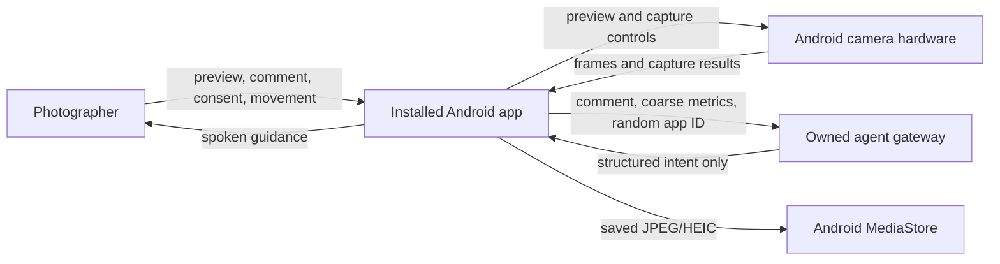
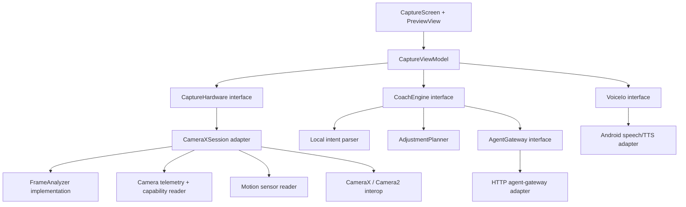

# Photo Helper — Android Technical Architecture

Status: implementation-ready draft  
Last reviewed: 2026-08-03  
Audience: Android engineers, backend engineers, hackathon judges, and technical reviewers

Companion document: [Android Product and Interaction Design](ANDROID_PRODUCT_DESIGN.md)

## 1. Executive decision

Build a native Android camera app in Kotlin. Use CameraX for preview, capture, exposure compensation, focus, and zoom; use Camera2 interop only for capability-gated ISO, shutter, and white-balance controls. Run frame measurements, face detection, and device-attitude tracking locally. Use a small remote agent endpoint only to translate ambiguous comments into a fixed intent vocabulary. The Android app—not the model—computes, validates, applies, and verifies camera changes.

The product loop is:

```text
observe → hear/read complaint → interpret → propose → obtain consent
        → act through camera controls → observe again → confirm or recover
```

This is an agent because it closes the observe–act–verify loop. A chat response without execution or verification is not considered successful.

### Selected stack

| Area | Decision |
|---|---|
| Language | Kotlin |
| UI | Jetpack Compose, single `Activity` |
| Camera | CameraX `Preview`, `ImageCapture`, and `ImageAnalysis` |
| Advanced controls | Experimental `Camera2CameraControl`/`Camera2CameraInfo`, isolated behind capability checks |
| Face analysis | Bundled ML Kit face detector in `FAST` mode |
| Body pose | Deferred; enable ML Kit Pose only for full-body coaching after the portrait MVP works |
| Orientation | Android rotation-vector/gravity sensors |
| Voice input | Push-to-talk on-device `SpeechRecognizer` only; typed input always available |
| Voice output | Android `TextToSpeech`, plus matching on-screen text and haptics |
| Agent reasoning | Hybrid local intent rules plus one remote structured-output endpoint |
| Persistence | No coaching/history database; photos use `MediaStore`, while native `SharedPreferences` stores remote-coaching consent, a resettable random client ID, and small accessibility/settings flags |
| Dependency injection | Manual constructor wiring; no Hilt for one screen |
| Gradle structure | One `:app` module; packages provide locality |
| Minimum Android version | API 31 (Android 12), enabling explicit on-device speech and scoped-storage-only support |
| Target/compile SDK | Latest stable SDK installed when implementation begins; do not freeze this architecture document to a Play-policy date |

## 2. Scope

### MVP supports

- Rear-camera capture; person-specific coaching requires exactly one stable detected face as the Coaching Subject, while exposure/color capture does not require a face.
- Live preview and still photo capture.
- Typed comments and push-to-talk comments.
- Four locally understood complaint families:
  - too bright / too dark;
  - too blue / too yellow;
  - face too large / too small;
  - subject misplaced / phone not level.
- One-tap application of supported setting changes.
- Spoken, visual, and haptic positional guidance.
- Verification after the setting or position changes.
- Offline behavior for the common, measurable intents.
- Remote interpretation for ambiguous or novel wording.

Across supported devices, the executable baseline is exposure compensation, face-size guidance, and phone/subject-position guidance. Color comments are always understood locally, but warm/cool application is capability-gated; an unsupported camera receives an honest advisory recommendation rather than a fake Apply action.

### Explicit non-goals for the hackathon

- Video recording.
- Editing an already captured image.
- Multiple-person pose coaching.
- A general photography chatbot.
- Continuous cloud video upload.
- Generative retouching, face reshaping, or beauty filters.
- A social feed, accounts, sync, or a coaching-history database.
- Feature parity with the phone manufacturer's default camera.
- Cross-platform architecture.

If a user comments after taking a photo, the proposed camera setting applies to the next capture. The UI must say “Apply for retake,” not imply that ISO or shutter can modify pixels already captured.

## 3. Quality targets

These are product targets, not claims about every Android device.

| Property | MVP target |
|---|---:|
| Camera preview visible after permission grant | under 1.5 s on the demo device |
| Local comment-to-recommendation latency | under 300 ms |
| Remote comment-to-recommendation latency | p50 under 2 s; hard timeout at 5 s |
| Setting application visible in preview | under 500 ms after tap |
| Guidance measurement rate | 4 Hz, independent of display frame rate |
| Spoken-instruction rate | no more than one instruction every 1.5 s |
| Analysis resolution | 640–720 px long edge unless detection confidence is insufficient |
| Remote request body | at most 8 KiB; comment at most 300 characters; no image or audio fields |
| Crashes or blocked shutter after analysis failure | zero tolerated |

## 4. System context



The app remains usable when the gateway is unavailable. Only phrasing outside the local intent vocabulary degrades.

## 5. In-app architecture



### Why these seams exist

- `CaptureHardware` has a CameraX adapter for production and a deterministic fake for state-machine tests. It hides device fragmentation and asynchronous camera operations behind one interface.
- `CoachEngine` is the main deep module. One call covers language interpretation, evidence checks, capability-aware planning, explanation, and a verification target.
- `AgentGateway` is a real remote seam. Production uses HTTP; tests use an in-memory adapter. The app owns all camera logic even though language interpretation may be remote.
- `VoiceIo` isolates Android speech lifecycles and provides a fake for ViewModel tests.
- `FrameAnalyzer`, capability reading, sensor fusion, and action planning are implementation details. They are not exposed to the UI as independent shallow interfaces.

## 6. Module interfaces

The snippets describe interfaces and invariants. They are not intended to be copied unchanged before the Gradle project and exact CameraX version exist.

### 6.1 Capture hardware

```kotlin
interface CaptureHardware {
    val capabilities: StateFlow<CameraCapabilities>
    val observation: StateFlow<FrameObservation?>
    val status: StateFlow<CameraStatus>

    suspend fun apply(adjustment: CameraAdjustment): ApplyResult
    suspend fun resetAutomaticControls(): ApplyResult
    suspend fun capture(): CaptureResult
}
```

Interface invariants:

- `apply` validates every value against the active camera's current capability ranges.
- `apply` returns only after the repeating capture result reflects the requested control, or returns a typed failure.
- A newer adjustment cancels an older in-flight adjustment.
- `capture` is rejected while the camera is unbound, never silently queued.
- `observation` is the latest analysis result; slow consumers do not accumulate old frames.
- `resetAutomaticControls` clears Camera2 overrides before re-enabling CameraX AE/AWB behavior.
- No method exposes `ImageProxy`, `CaptureRequest`, or ML Kit types outside the module.

`CameraXSession` also has an Activity-owned `bind(lifecycleOwner, surfaceProvider)` function. It is deliberately not called from the ViewModel, preventing lifecycle objects from entering UI state.

### 6.2 Coaching engine

```kotlin
interface CoachEngine {
    suspend fun recommend(input: CoachingInput): CoachRecommendation
    fun verify(
        target: VerificationTarget,
        current: FrameObservation
    ): VerificationResult
}
```

Interface invariants:

- It returns one primary action, not a menu of simultaneous instructions.
- It never proposes an action unsupported by `input.capabilities`.
- A setting recommendation includes the exact computed adjustment and a reversible reset path.
- A movement recommendation includes a measurable target and a safety preamble when it asks the user to walk.
- Ambiguous, unsupported, negated, or polarity-conflicted language returns a clarification instead of an executable action.
- `verify` is pure and deterministic.
- A clear-direction complaint may express a `UserPreference` even when defect evidence is absent. In that case the recommendation labels the mismatch and offers a reversible directional change; it does not claim a `MeasuredDiagnosis`.
- A diagnosis uses `DefectVerification`. A preference uses `EffectVerification` followed by user confirmation; applying the requested effect is not presented as objective quality improvement.

### 6.3 Agent gateway

```kotlin
interface AgentGateway {
    suspend fun classify(request: AgentRequest): AgentIntentResult
}
```

The gateway may interpret language and scene context. It cannot call Android controls directly. A fake adapter returns fixture responses for tests.

### 6.4 Voice I/O

```kotlin
interface VoiceIo {
    suspend fun listenOnce(locale: Locale): VoiceResult
    fun speak(text: String, utteranceId: String)
    fun stopSpeaking()
    fun close()
}
```

Push-to-talk is required. On microphone tap, call `isOnDeviceRecognitionAvailable` and use `createOnDeviceSpeechRecognizer` only. Cloud-backed default speech recognition is not allowed in the MVP. Before first use, disclose: `Android transcribes voice on this device. Photo Helper does not store or send your audio.` If the on-device model or requested language is unavailable, disable voice for that session and retain typed input; never fall back silently to a network recognizer.

## 7. Domain data

### 7.1 Frame observation

```kotlin
data class FrameObservation(
    val timestampMs: Long,
    val meanLuma: Float,
    val highlightClipFraction: Float,
    val shadowClipFraction: Float,
    val chromaBlueBias: Float?,
    val faces: List<FaceObservation>,
    val primaryBody: BodyObservation?,
    val deviceRollDegrees: Float?,
    val devicePitchDegrees: Float?,
    val motionScore: Float,
    val sourceWidth: Int,
    val sourceHeight: Int
)
```

Coordinates are normalized to the displayed preview after rotation and crop. Detector-probability fields are `0.0..1.0`; they are unrelated to remote model authority. Measurements derived from stale frames older than 750 ms are not executable evidence.

### 7.2 Camera capabilities and telemetry

```kotlin
data class CameraCapabilities(
    val exposureCompensationRange: IntRange,
    val exposureCompensationStepEv: Float,
    val supportsManualExposure: Boolean,
    val isoRange: IntRange?,
    val exposureTimeNsRange: LongRange?,
    val supportsManualColorCorrection: Boolean,
    val supportedAwbModes: Set<AwbMode>,
    val zoomRatioRange: ClosedFloatingPointRange<Float>,
    val hardwareLevel: HardwareLevel
)

data class CameraTelemetry(
    val exposureCompensationIndex: Int,
    val iso: Int?,
    val exposureTimeNs: Long?,
    val whiteBalanceMode: AwbMode?,
    val calibratedWhiteBalanceTemperatureK: Int?,
    val zoomRatio: Float
)
```

Manual controls are enabled only when the request keys, ranges, and hardware level support them on the active physical camera. Switching lenses invalidates capabilities and telemetry; the planner must recompute before Apply becomes enabled.

### 7.3 Intent vocabulary

The remote model and local parser may return only:

```text
EXPOSURE_DARKER      EXPOSURE_BRIGHTER
FREEZE_MOTION        REDUCE_NOISE
WHITE_BALANCE_WARMER WHITE_BALANCE_COOLER RESET_WHITE_BALANCE
FACE_OCCUPANCY_LOWER FACE_OCCUPANCY_HIGHER
PLACE_SUBJECT_FRAME_LEFT PLACE_SUBJECT_FRAME_RIGHT
FRAME_HIGHER             FRAME_LOWER        LEVEL_FRAME
FULL_BODY_TALLER     CLARIFY                UNSUPPORTED
```

This vocabulary is intentionally semantic. The model does not select an arbitrary ISO, nanosecond shutter value, or sensor gain.

These values are `FrameGoal`s in unmirrored saved-image coordinates, not movement instructions. The MVP planner emits only photographer/camera actions:

```text
PAN_CAMERA_LEFT          PAN_CAMERA_RIGHT
TILT_CAMERA_UP           TILT_CAMERA_DOWN
ROLL_CAMERA_CLOCKWISE    ROLL_CAMERA_COUNTERCLOCKWISE
STEP_PHOTOGRAPHER_BACK   STEP_PHOTOGRAPHER_FORWARD
RAISE_CAMERA             LOWER_CAMERA
```

For example, `PLACE_SUBJECT_FRAME_LEFT` maps to `PAN_CAMERA_RIGHT`, and verification expects the Coaching Subject's normalized x-coordinate to decrease. TTS always speaks the `GuidanceAction`, including its actor: “Aim the phone slightly right.” Subject-body movement, front-camera mirroring, and tripod actor switching are outside the MVP.

### 7.4 Executable adjustments

```kotlin
sealed interface CameraAdjustment {
    data class ExposureCompensation(val targetIndex: Int) : CameraAdjustment
    data class ManualExposure(val iso: Int, val exposureTimeNs: Long) : CameraAdjustment
    data class WhiteBalance(
        val mode: AwbMode,
        val calibratedGains: ColorGains? = null
    ) : CameraAdjustment
    data class ZoomRatio(val ratio: Float) : CameraAdjustment
}

sealed interface RecommendationAction {
    data class ApplySetting(val adjustment: CameraAdjustment) : RecommendationAction
    data class GuidePosition(val target: VerificationTarget) : RecommendationAction
    data class AskClarification(val question: String) : RecommendationAction
    data class ExplainOnly(val reason: String) : RecommendationAction
}
```

Every recommendation also carries a basis:

```kotlin
enum class RecommendationBasis {
    MEASURED_DIAGNOSIS,
    USER_PREFERENCE
}
```

When the basis is `USER_PREFERENCE`, contradictory frame evidence becomes tradeoff copy, not an automatic refusal. Unsupported controls and unsafe physical movement remain non-executable.

Each recommendation carries `RecommendationProvenance`: observation ID/time, camera session ID, active camera/lens ID, capability revision, telemetry revision, live-or-review origin, Subject Lock ID when relevant, basis, and creation time.

Apply preconditions:

- Camera phase is `READY`; no capture or setting application is in flight.
- Camera session, lens, capability revision, and any required Subject Lock still match.
- Current telemetry exists and the proposed value remains within capability ranges.
- Live `MEASURED_DIAGNOSIS` evidence is no older than 750 ms. Stale evidence reruns the same Complaint against the latest observation and replaces or withdraws the recommendation.
- Live `USER_PREFERENCE` direction may remain for at most 30 seconds in the same foreground session, but its concrete adjustment is always replanned from fresh observation and telemetry.
- Backgrounding, a camera/lens/session change, or Subject Lock loss invalidates every live recommendation.
- Actual captured pixels in an open Capture Review do not age, but an `Apply for retake` adjustment is still replanned against the current camera. After backgrounding, it remains visible but disabled until replanning succeeds.

`AdjustmentPlanner` performs the semantic-to-device mapping. Examples:

- `EXPOSURE_DARKER`: start with `−0.7 EV`, quantize to the device step, clamp to its range, then verify reduced clipping.
- `FREEZE_MOTION`: treat the explicit `Freeze movement` choice as a preference; bare `blurry` first clarifies `Freeze movement` versus `Focus missed`. Apply only on a capability-probed camera with stable exposure telemetry and the calculation below.
- `REDUCE_NOISE`: lower ISO only when a longer shutter is safe according to `motionScore`; otherwise explain the tradeoff instead of applying a lossy change.
- `WHITE_BALANCE_WARMER`: use a tested AWB preset or calibrated color gains only if the active camera supports them; otherwise offer Reset AWB.

For the required demo-device `FREEZE_MOTION` plan, target a bounded two-stop shutter improvement:

```text
idealExposureTime = currentExposureTime / 4
targetExposureTime = quantizeToSupported(idealExposureTime)
targetISO = quantizeToSupported(
    currentISO * currentExposureTime / targetExposureTime
)
```

Clamp ISO to both the reported sensor range and a calibrated demo-device noise ceiling. From 1/120 s at ISO 400, this yields approximately 1/500 s at ISO 1600. If the full compensation exceeds the ceiling, compute the fastest shutter that preserves brightness at that ceiling. Offer Apply only when the result is at least one stop faster and quantization predicts no more than 0.3 EV brightness loss; show the exact before/after values and `Freezes more motion; adds noise.` Otherwise return `Add light or ask the subject to slow down` advice without Apply.

The judged comparison begins from a deliberately blurry saved photo in Capture Review, not a preview frame. `Apply for retake` uses its actual capture telemetry, revalidates the same camera, and acknowledges the new settings in the repeating capture result. After the retake is saved, decode both saved images, require the same lens/subject/region and the comparability bounds below, align the subject crop, and compare a simple on-device gradient-sharpness score. A 15% or greater improvement permits `Subject detail is sharper.` This metric cannot distinguish motion blur from missed focus, so the app never claims `motion blur fixed`. A live-preview complaint can authorize the preference and verify only that faster settings became active; visual improvement remains unknown until a comparable retake exists.

Verification reports three separate outcomes:

- `Applied`: the camera future/capture result acknowledges the requested control.
- `EffectObserved`: Comparable Observations show the predicted metric changed in the expected direction.
- `RequestSatisfied`: a diagnosis reaches its target, or the photographer confirms `Yes, closer` after a preference effect.

For setting comparisons, use the same camera/lens and Subject Lock/region, roll/pitch delta under 2°, subject center/size drift under 5%, low scene motion, and three stable samples before and after 3A settles. If these conditions fail, the visual evidence is incomparable. `Applied` plus incomparable evidence says `Setting applied, but the scene changed, so I can’t verify the visual result.` Comparable but unchanged says `Setting applied, but I don’t see the expected change yet.` An observed direction that has not reached its target says so without declaring success.

## 8. Orthogonal UI state

Camera lifecycle and coaching work are independent dimensions; one mutually exclusive state enum cannot describe “camera ready while guidance is active.”

```kotlin
data class CaptureUiState(
    val cameraPhase: CameraPhase,
    val coachingPhase: CoachingPhase,
    val review: SavedCapture? = null
)

enum class CameraPhase { STARTING, READY, CAPTURING, REVIEWING, BLOCKED }

enum class CoachingPhase {
    IDLE,
    LISTENING,
    INTERPRETING,
    RECOMMENDATION,
    APPLYING,
    GUIDING,
    VERIFYING,
    TRANSIENT_ERROR
}
```

Only `CaptureViewModel` transitions these fields. Camera, voice, and network callbacks become typed events processed serially in `viewModelScope`. Every asynchronous job carries a request ID so a cancelled or superseded result cannot mutate state.

The shutter is enabled only when `cameraPhase == READY` and `coachingPhase != APPLYING`:

| Coaching phase on shutter | Required behavior before capture |
|---|---|
| `IDLE` | Capture directly |
| `LISTENING` | Stop recognizer and discard partial speech |
| `INTERPRETING` | Cancel local/network work and invalidate its request ID |
| `RECOMMENDATION` | Clear the unapplied recommendation |
| `GUIDING` / `VERIFYING` | Stop TTS/haptics, release Subject Lock, and end verification |
| `TRANSIENT_ERROR` | Clear the error |
| `APPLYING` | Shutter disabled until camera acknowledgement or failure; do not queue a press |

Capture takes priority over cancellable coaching. `STARTING`, `CAPTURING`, `REVIEWING`, and `BLOCKED` camera phases disable the shutter. Coaching work never survives into a new capture implicitly.

`REVIEWING` owns a `SavedCapture` containing the MediaStore URI, review image, actual-capture observation, captured telemetry, and applied baseline. The camera remains lifecycle-bound for a quick retake, but the review obscures preview, pauses live analysis, and hides the shutter. A review-origin recommendation retains its origin until Apply or dismissal.

## 9. Camera pipeline

### 9.1 Bound CameraX use cases

- `Preview` renders into `PreviewView` hosted through Compose `AndroidView`.
- `ImageCapture` writes the final photo.
- `ImageAnalysis` uses `STRATEGY_KEEP_ONLY_LATEST`; it must close each `ImageProxy` in `finally`.
- Target analysis is 640×480 or the closest supported 4:3 size. The preview and capture retain the selected UI aspect ratio.

Do not block the analyzer waiting for speech, network, or TTS. The analyzer produces an immutable observation and returns.

### 9.2 Analysis schedule

1. Read luma/chroma statistics from the YUV planes every 250 ms.
2. Run face detection on the same sampled frame using ML Kit `FAST` mode.
3. Run pose detection only while a full-body intent is active.
4. Merge device roll/pitch from the latest rotation-vector sample.
5. Publish one `FrameObservation` to a conflated `StateFlow`.

If a detector is still busy, discard the new analysis request. Fresh guidance matters more than processing every frame.

### 9.3 Measurements

- Brightness: 64-bin luma histogram computed over a subsampled grid.
- Highlight clipping: fraction of sampled luma at or above a calibrated high threshold.
- Shadow clipping: equivalent low threshold.
- Blue cast: average chroma bias after excluding near-black, near-white, and highly saturated pixels. Treat it as weak evidence; blue scenes are legitimate.
- Face size: face-box width divided by displayed-preview width.
- Face position: face-box center relative to safe composition regions.
- Horizon/level: device roll; image-derived horizon is a later fallback.
- Step-back progress: decreasing face-size trend over several observations. The app does not claim to measure physical distance.

Thresholds belong in one `CoachThresholds` value object so they can be calibrated on the demo device. This is physical-camera tuning, not speculative configuration.

Regional exposure is outside the MVP. `EXPOSURE_DARKER` and `EXPOSURE_BRIGHTER` diagnose only whole-frame luma/clipping. “Background too bright” or “my face is dark” produces the fixed clarification `Whole photo`, `Person/face`, `Background`; only `Whole photo` can lead to global EV Apply. The other choices receive advisory tradeoff copy because global EV changes both subject and background.

### 9.4 Coaching Subject qualification

- Never treat `faces[0]`, the largest face, or the closest face as a stable subject.
- With one detected face, create a session-local Subject Lock from the ML Kit tracking ID and normalized box.
- With zero faces, withhold person-specific coaching and ask the photographer to point at the person.
- With multiple faces, pause or withhold person-specific coaching and say `I see more than one person. Frame only the person you want help with.` There is no tap-to-select UI in the MVP.
- A newly entering face never inherits an existing lock.
- Use geometric continuity only to bridge a brief missing tracking ID; it is not identity recognition.
- If the locked face is missing for more than 750 ms, pause speech and verification.
- Resume only if the same track or one unambiguous geometric continuation returns within three seconds.
- After three seconds, or whenever a second candidate is present, abort guidance and require exactly one stable face again.

Detection order may change without affecting the Coaching Subject.

### 9.5 Setting application

Use high-level CameraX controls first:

- exposure compensation;
- zoom;
- focus and metering;
- torch when explicitly requested in a later phase.

Use Camera2 interop only for manual ISO, shutter, or white balance. The interop interface is marked experimental; its options override CameraX controls and may disturb 3A behavior.

Before the first coached control Apply in a bound-camera session, record `ControlBaseline`: the complete observed automatic/manual state keyed by camera-session ID, active physical/lens ID, and capability revision. Keep it as Reset's target across chained Applies. Separately update `lastCommittedControlState` after each capture-result acknowledgement.

Each Apply is a transaction:

1. validate a complete desired state against the current key and capability ranges;
2. clear incompatible fields during a mode change—AE-to-manual clears EV compensation, and manual-to-AE clears sensor exposure/ISO overrides;
3. submit one complete request-options bundle and await the future plus repeating-capture-result acknowledgement;
4. commit only after acknowledgement;
5. on failure or timeout, restore `lastCommittedControlState`; if that rollback is not acknowledged, clear Camera2 overrides, force safe AE/AWB automatic controls, and report the failure.

Reset restores `ControlBaseline`, not merely the previous action. Capture Review retains both snapshots only while the same camera key remains bound, and `Apply for retake` revalidates them. Lens change, capability revision, camera unbind, or app background invalidates both snapshots and clears overrides. Reset is enabled only when its key matches the current camera; a stale baseline is never applied to a new session.

Do not mix CameraX exposure compensation with a Camera2 request that disables AE.

Android Camera2 does not expose one universal “set Kelvin” control. Warm/cool application must use a supported AWB mode or device-tested color-correction gains. A Kelvin value may be shown only when the active-camera adapter has a calibrated mapping; otherwise the UI says `Warmer`, `Cooler`, or `Auto`.

### 9.6 Capture and storage

- Use `ImageCapture.takePicture(OutputFileOptions, …)`.
- Write to `MediaStore.Images` under `Pictures/PhotoHelper`; on the supported API 31+ range, no broad storage permission is needed for media created by the app.
- Record the applied settings in EXIF only if the capture result supplies them reliably.
- A failed coaching analyzer must never disable the shutter.

After a successful save, decode the actual saved pixels at analysis resolution and enter `ReviewingCapture`; do not use the last preview frame as capture truth. Capture telemetry comes from the still-capture result or EXIF and is marked unknown when unavailable. `Done` dismisses review, while `Retake` returns unchanged to preview. Both retain the already-saved original and perform no second write or deletion. Review copy states `Original remains saved`. A post-capture comment uses actual captured pixels and available telemetry as its `RetakeBaseline`. `Apply for retake` revalidates the active camera, applies a plan relative to that baseline, returns to live preview, and verifies against fresh observations. A lens or capability change invalidates the old plan and forces recomputation.

## 10. Agent pipeline

### 10.1 Local-first decision

The local parser handles synonyms for the MVP intents, for example:

```text
"too bright", "washed out", "highlights gone" → EXPOSURE_DARKER
"too blue", "cold", "icy skin"              → WHITE_BALANCE_WARMER
"face occupies too much frame"              → FACE_OCCUPANCY_LOWER
"face too big", "too close"                 → FACE_SIZE_MEANING_UNCLEAR
"crooked", "not straight"                  → LEVEL_FRAME
```

It may execute only when an exact normalized phrase family has an unambiguous direction, the on-device negation/polarity guard agrees, and local evidence/capabilities authorize the action. Otherwise it asks an app-owned clarification or, with Remote Coaching Consent, calls the gateway. Model-reported confidence is not accepted or used.

The MVP is one-Complaint-at-a-time, not conversational memory. A new complete comment cancels and replaces the prior recommendation; shutter, capture completion, or camera-session change ends the lifecycle. Only clarification chips carry explicit machine context. Literal `reset` or `undo last camera adjustment` is a local command when the current `ControlBaseline` is valid. Detect elliptical free text such as `a little more`, `do the opposite`, or `no, the background` locally and request a complete complaint; never send it as an executable remote request.

### 10.2 Gateway request

`POST /v1/coach/classify`

This request is permitted only after Remote Coaching Consent. Local-only mode never calls the endpoint.

```json
{
  "schemaVersion": 1,
  "clientInstanceId": "random-resettable-uuid-v4",
  "sessionId": "ephemeral-uuid",
  "comment": "the whole shot is washed out",
  "locale": "en-SG",
  "observation": {
    "meanLuma": 0.84,
    "highlightClipFraction": 0.12,
    "faceCount": 0
  },
  "availableIntents": ["EXPOSURE_DARKER", "CLARIFY"]
}
```

The body is strict JSON, at most 8 KiB, and `comment` is at most 300 characters. It has no image, audio, EXIF, URI, face-landmark, tracking-ID, or Android hardware-ID field. The random client ID is created only when advanced coaching is enabled, stored in `SharedPreferences`, regenerated by `Reset advanced-coaching ID`, and reset by uninstall/reinstall.

### 10.3 Gateway response

```json
{
  "schemaVersion": 1,
  "intent": "EXPOSURE_DARKER",
  "ambiguityCode": "NONE"
}
```

The response is semantic data only. Allowed ambiguity codes are fixed enums such as `NONE`, `REGION_UNCLEAR`, `FACE_SIZE_MEANING_UNCLEAR`, `SUBJECT_UNCLEAR`, `TRADEOFF_REQUIRED`, and `UNSUPPORTED`. The installed app owns every diagnosis sentence, explanation, safety preamble, instruction, TTS utterance, clarification question, and chip label through reviewed templates. Model output is never rendered.

Validation rules:

- reject unknown keys if strict decoding is available;
- reject unknown intent values;
- reject all free-text response fields;
- require `ambiguityCode == NONE` before an intent is eligible for planning;
- require the on-device negation/polarity guard to agree with the returned direction;
- never translate model output directly into Camera2 keys;
- fall back to an app-owned clarification template after timeout, malformed JSON, polarity conflict, or insufficient evidence.

### 10.4 Concrete hackathon backend

Deploy one Cloudflare Worker with one public route, `POST /v1/coach/classify`; do not add a web framework, database, accounts, or provider abstraction. The APK receives the public HTTPS URL through `BuildConfig.COACH_ENDPOINT` per build type. `OPENAI_API_KEY` is a Cloudflare Worker secret and never enters source control, Gradle properties, or the APK.

The Worker calls the OpenAI Responses API with:

- selected moving model alias `gpt-5.6-luna`—not an immutable snapshot;
- `reasoning.effort: "none"`;
- Structured Outputs with strict `schemaVersion = 1` enums;
- `store: false`, no background mode, tools, files, image, or audio;
- independently fixed `promptVersion = 1` and `schemaVersion = 1`.

The model alias, prompt, and schema are server-owned; the client cannot select them. The 240-utterance classifier corpus must pass immediately before each manual Worker deployment and again during the same-day demo rehearsal. The Worker requires the upstream Responses `model` field to equal `gpt-5.6-luna`; another value fails closed. Because the alias can drift without a deploy, a Worker environment kill switch disables remote classification when rehearsal fails. Local coaching remains available.

Boundary controls:

- accept only HTTPS `POST` with `Content-Type: application/json`;
- reject bodies over 8 KiB with 413, comments over 300 characters or invalid schema with 400, and unknown response fields/enums with a typed unavailable response;
- abort the OpenAI fetch after five seconds and never retry automatically;
- use a Cloudflare Rate Limiting binding keyed by the random client ID for 10 requests per minute, with a separate IP-based edge rule where the account plan supports it; return 429 when limited;
- document that the rate limiter is location-local, permissive, and eventually consistent; the OpenAI project spend cap, remote kill switch, and post-hackathon shutdown are the hard cost limits;
- log only request ID, latency, status, selected intent, and error class—never raw comments, metrics, client IDs, or response content—and return `Cache-Control: no-store`.

The Worker sends the random `clientInstanceId` to OpenAI as `safety_identifier`. Cloudflare necessarily observes the client IP. `store: false` avoids Responses application-state storage, but ordinary OpenAI abuse-monitoring logs can include inputs/outputs for up to 30 days unless the project is separately approved and configured for Modified Abuse Monitoring or Zero Data Retention. Do not claim zero retention. Disable the endpoint and delete its provider secret after judging.

Deployment acceptance covers valid fixtures, 400/413/429 paths, a simulated upstream timeout, invalid provider output, the alias-model-field check, the kill switch, content-free logs, and a source/APK secret scan. A public hackathon client cannot prevent determined abuse; these controls bound ordinary misuse and cost rather than providing user authentication.

The remote classifier is English-only for the MVP. Voice requires an installed on-device English recognizer, initially exercised with `en-US`, `en-GB`, and `en-SG`; typed English remains available. Unsupported language or locale stays local and produces English chips/advice rather than a transmission.

Before every prompt, schema, model-alias, or Worker change, run 240 fixed utterances: 120 supported paraphrases balanced across four complaint families and directions, 60 negation/contrast cases, 30 ambiguous cases, and 30 unsupported or noisy-ASR cases. Release requires at least 95% correct intent+direction on the supported set, zero wrong-direction executable results in the negation/ambiguous sets, and 100% fail-closed behavior for invalid/unknown schema. Every non-passing result must clarify or advise rather than Apply.

## 11. Positional guidance

A movement recommendation is converted into a `VerificationTarget`, not an unbounded stream of prose.

Examples:

| Intent | Initial instruction | Verification metric | Completion |
|---|---|---|---|
| `FACE_OCCUPANCY_LOWER` | “I cannot inspect your path. Move only if you can independently verify it.” then one small step | face-width trend | target fraction reached for 500 ms |
| `PLACE_SUBJECT_FRAME_LEFT` | “Aim the phone slightly right.” | subject-center x decreases | center enters target band |
| `FRAME_HIGHER` | “Tilt the phone slightly down.” | pitch and subject position | both enter band |
| `LEVEL_FRAME` | “Rotate the phone a little clockwise.” | absolute roll | under 1.5° for 500 ms |
| `FULL_BODY_TALLER` | “Lower the phone toward hip height.” | body visibility, pitch, pose proportions | experimental; confirm with user |

Guidance rules:

- Speak one instruction at a time.
- Do not say “keep going” more than twice without re-evaluating.
- Require a stable target across multiple frames to avoid oscillation.
- Use a short success earcon and haptic instead of another sentence.
- Stop guidance immediately when the user taps Cancel, backgrounds the app, or loses the subject.
- The app has no hazard detector and never infers that a path is safe. Each translational action card states the limitation and requires a per-action `Start one-step guidance` tap before movement.
- Ask for at most one small step, then stop and re-measure. Dismissal produces distance advice; a small zoom-out Apply is allowed only within the active lens and validated zoom range.
- When Android touch exploration is active, do not offer walking instructions. Keep stationary pan/tilt/level guidance and advisory distance or capability-gated continuous-zoom alternatives.

“Face too big” is ambiguous. The app asks `Takes up too much frame` versus `Features look distorted`. The first selects measurable Face Occupancy coaching. The second identifies possible Close-Perspective Distortion and returns advisory copy—step back, then use a longer lens or zoom to restore framing—without a guided success claim.

## 12. Concurrency and lifecycle

- Main thread: Compose rendering, camera binding, SpeechRecognizer calls required by Android, and state dispatch.
- Camera executor: CameraX analysis callback and capture callback.
- Analysis dispatcher: histogram and ML Kit work; at most one analysis job at a time.
- IO dispatcher: gateway HTTP call and MediaStore preparation.
- ViewModel scope: serialized product-state transitions.

Cancellation behavior:

- A new comment cancels the previous interpretation request.
- Backgrounding cancels listening, TTS, guidance, analysis jobs, and in-flight setting application.
- CameraX binding follows the Activity lifecycle.
- `SpeechRecognizer.destroy()` and `TextToSpeech.shutdown()` run when their adapter closes.
- Network timeout is five seconds; retry only after explicit user action.

## 13. Proposed source layout

```text
app/src/main/java/.../photohelper/
  MainActivity.kt
  AppGraph.kt                    # manual construction only
  capture/
    CaptureScreen.kt
    CaptureViewModel.kt
    CaptureUiState.kt
    CaptureHardware.kt
    CameraXSession.kt
    FrameObservation.kt
    CameraCapabilities.kt
  coach/
    CoachEngine.kt
    HybridCoachEngine.kt
    CoachingModels.kt
    AdjustmentPlanner.kt
    Verification.kt
  voice/
    VoiceIo.kt
    AndroidVoiceIo.kt
  agent/
    AgentGateway.kt
    HttpAgentGateway.kt
    AgentContracts.kt
  ui/
    PhotoHelperTheme.kt

app/src/test/java/.../
  coach/CoachEngineTest.kt
  coach/AdjustmentPlannerTest.kt
  capture/CaptureViewModelTest.kt

app/src/androidTest/java/.../
  capture/CameraSmokeTest.kt
  capture/PermissionFlowTest.kt
```

Do not create separate Gradle modules until build time, team ownership, or reuse demonstrates a real need.

## 14. Dependencies

Use the versions from the current stable AndroidX/Google release catalog at implementation time.

Required:

- Compose BOM and Material 3.
- `activity-compose`.
- Lifecycle ViewModel Compose and lifecycle-aware state collection.
- Kotlin coroutines.
- CameraX core, camera2, lifecycle, view, and extensions only if an extension is actually used.
- Bundled ML Kit face detection so the first-run demo does not wait for a model download.

Conditional:

- ML Kit pose detection only in the full-body phase.
- A JSON library only if the chosen model/backend client does not already provide one. Prefer platform JSON for the single small contract.
- No Hilt, Room, Retrofit, navigation library, analytics SDK, or image-loading library in the MVP.

## 15. Permissions and privacy

Manifest permissions:

```xml
<uses-permission android:name="android.permission.CAMERA" />
<uses-permission android:name="android.permission.RECORD_AUDIO" />
<uses-permission android:name="android.permission.INTERNET" />
```

- Request camera permission when the user enters capture.
- Request microphone permission only when the microphone button is first used.
- If microphone permission is denied, typed comments remain fully usable.
- No location, contacts, media-library read, background camera, or background microphone permission.
- Default Remote Coaching Consent is `ASK`. Before the first request, disclose the full path: comment, locale, coarse brightness/color/face-count/face-size metrics, and a random resettable app ID go to Photo Helper's Cloudflare Worker; Cloudflare sees the client IP for abuse protection; the Worker sends the comment, metrics, and app ID to OpenAI. No photo, audio, EXIF, URI, landmarks, tracking ID, or Android hardware ID leaves the phone.
- `Enable advanced coaching` creates a UUIDv4 `clientInstanceId` and persists it with `ENABLED` in `SharedPreferences`. `Stay local` or dismissal sends nothing. Settings can change the consent and `Reset advanced-coaching ID`; uninstall/reinstall also resets consent and the ID.
- The Worker sends the random ID as OpenAI's `safety_identifier`. It sets `store: false`, but the UI/privacy copy states that ordinary OpenAI abuse-monitoring logs may retain API input/output for up to 30 days unless separately approved data controls apply. It does not claim zero provider retention; Cloudflare security/platform metadata follows the deployed account configuration.
- All camera and captured-photo pixels remain on-device for both local and advanced coaching.
- Use TLS only; block cleartext traffic in network security configuration.
- Never log comments, scalar measurements, random client IDs, transcripts, image bytes, content URIs, or face geometry in production logs.

## 16. Compatibility and graceful degradation

| Missing capability | Behavior |
|---|---|
| No on-device speech recognizer/model/language | Disable voice for the session and explain; typed input remains available |
| Microphone denied | Hide listening state; retain text input |
| Manual exposure unsupported | Use EV compensation and explain that exact ISO/shutter application is unavailable |
| Manual WB unsupported | Offer Reset AWB or spoken lighting advice |
| Gyroscope/rotation vector unavailable | Use face-position guidance; disable precise leveling or add image horizon later |
| Face detector finds no face | Do not emit portrait movement instructions; ask the user to point at the subject |
| Face detector finds multiple faces | Pause person-specific coaching and ask the photographer to frame only one person; do not select or switch |
| Android touch exploration active | Keep stationary phone guidance; replace walking with distance advice or a capability-gated continuous zoom action |
| Gateway offline/timeout | Run local intent rules; ask a constrained clarification for unknown comments |
| Device camera privacy toggle off | Show the system-specific recovery message; do not treat blank frames as darkness |
| Camera2 override fails | Clear overrides, restore automatic controls, and keep the shutter usable |

The hackathon demo device should be selected and capability-probed early. Android camera behavior varies enough that manual settings cannot be promised universally.

## 17. Verification strategy

### Pure JVM checks

- Intent synonym mapping.
- Gateway JSON parsing and rejection of invalid values.
- Exposure EV-to-index quantization and range clamping.
- Manual shutter/ISO tradeoff calculations.
- White-balance range clamping.
- `Applied`, `EffectObserved`, and `RequestSatisfied` remain distinct through comparable, changed, unchanged, and incomparable observations.
- Verification target hysteresis and timeout behavior.
- ViewModel state transitions with fake camera, voice, and gateway adapters.

### Image fixtures

Keep a small fixture set covering:

- clipped highlights;
- deep shadows;
- neutral scene and intentionally blue scene;
- small, medium, and oversized faces;
- centered and off-center faces;
- multiple faces, no face, partially occluded face;
- level and tilted device metadata.

Assert measurements and intent eligibility, not aesthetic “beauty scores.”

### Instrumented device checks

- Camera permission grant, denial, and “only this time.”
- Preview + analysis + still capture bound concurrently.
- EV adjustment visibly changes preview and is reported in capture state.
- Manual-mode Apply followed by Reset returns to stable AE/AWB.
- Speech cancellation, recognizer-busy errors, and TTS interruption.
- On-device recognizer available/unavailable and language-model-missing paths; the app never invokes the default cloud-capable recognizer.
- Background/foreground does not leak camera or microphone resources.
- Captured photo appears in the expected album.

Use a real physical phone for camera acceptance; emulator success is not evidence of hardware behavior.

Physical test matrix:

- primary stage device on its exact OS build and rear lens, with camera capability probe passed and the required on-device speech language installed;
- one API 31/32 compatibility device;
- one current-target API 35/36 device as available.

API 23–30 are unsupported and need no storage, review, or voice test coverage.

### End-to-end acceptance scenarios

1. “The whole shot is too bright” produces a bounded darker recommendation. Apply first reports `Applied`; improvement is reported only from Comparable Observations, otherwise the app uses the incomparable/unchanged copy.
2. “Face too big” asks the occupancy-versus-distortion clarification; the occupancy choice discloses that hazards are unknown, and one `Start one-step guidance` tap begins a single step/re-measure loop. The touch-exploration variant produces advice or safe continuous zoom instead.
3. “Looks blue” returns a capability-aware WB action or Reset AWB; it never invents an unsupported Kelvin value.
4. A second face entering aborts person-specific guidance and requires exactly one stable face again; it never silently switches or asks for visual selection.
5. Unsupported, ambiguous, negated, or polarity-conflicted language asks one short clarification and leaves the shutter usable.
6. Airplane mode understands the four local MVP complaint families. On cameras without stable WB control, color produces clearly labeled advice rather than an Apply button; the other three families retain their executable baseline.
7. A saved photo enters Capture Review; Done retains the URI, while a post-capture comment analyzes actual captured pixels and produces an `Apply for retake` plan tied to the captured baseline.
8. On the tested demo phone, a deliberately blurry saved photo with 1/120 s and ISO 400 receives `Freeze movement`; Apply for retake proposes about 1/500 s and ISO 1600, hardware acknowledgement precedes capture, Reset restores the session ControlBaseline, and only comparable saved retake pixels may produce `Subject detail is sharper`.

## 18. Implementation plan

### Phase 0 — project and installable vertical slice

- Create one native Android project, single Activity, Compose UI.
- Bind CameraX Preview and ImageCapture.
- Request camera permission in context.
- Save one photo to MediaStore.
- Show the saved photo in Capture Review with truthful Done and Retake actions; both retain the original.
- Select and capability-probe the exact stage phone/lens: manual sensor control, capture-result acknowledgement, Reset to stable AE, and installed on-device English speech must pass now. If manual exposure is unstable, choose a different stage phone before feature freeze.
- Produce and install a signed debug APK on the demo phone.

Exit: the app launches from the home screen, previews, captures, and saves without coaching.

### Phase 1 — observations

- Add `ImageAnalysis` with keep-latest backpressure.
- Produce luma/clipping metrics.
- Add bundled ML Kit face detection.
- Add roll/pitch sensor readings.
- Render a developer overlay showing metrics and capability ranges.

Exit: measurements update without visible preview jank.

### Phase 2 — deterministic coach and one-tap exposure

- Implement data contracts, local intent parser, planner, and verification.
- Support exposure, color, face-occupancy, and phone-position wording from typed comments. The first executable set is `EXPOSURE_DARKER`, `EXPOSURE_BRIGHTER`, `FACE_OCCUPANCY_LOWER`, and `LEVEL_FRAME`; warm/cool comments return capability-aware AWB advice unless optional Phase 6 work proves stable control.
- Apply CameraX EV compensation and verify it.
- Add Reset.

Exit: two setting and two positional demos work offline.

### Phase 3 — required demo-device manual exposure

- Implement keyed `ControlBaseline`, `lastCommittedControlState`, transactional Apply/rollback, and invalidation on lens/session/background changes.
- Add the bounded `FREEZE_MOTION` shutter/ISO calculation through Camera2 interop on the demo device.
- Build the Capture Review → Apply for retake → saved retake comparison and Reset path.
- Run the 1/120 s at ISO 400 → approximately 1/500 s at ISO 1600 acceptance scenario repeatedly.

Exit: the tested demo phone applies, acknowledges, compares, and resets manual exposure; unsupported devices return EV/advice.

### Phase 4 — remote language interpretation

- Deploy the single Cloudflare Worker `/v1/coach/classify` endpoint with strict enum schema, `gpt-5.6-luna`, `store: false`, timeout, rate-limit binding, kill switch, and server-side provider secret.
- Add the complete remote-consent screen and resettable random client ID; send only comments and coarse scalar metrics.
- Run the 240-utterance gate, malformed/timeout/rate-limit fixtures, log inspection, and source/APK secret scan.

Exit: paraphrases resolve to the same local intent, invalid results fail closed, no pixels leave the phone, and the local path survives shutdown.

### Phase 5 — voice and guidance

- Add push-to-talk recognizer with typed fallback.
- Add TTS, haptics, instruction cooldown, and cancellation.
- Implement closed-loop face-size and phone-level guidance.

Exit: the user can complete the core flow without touching the screen after starting guidance.

### Phase 6 — demo hardening

- Remove or hide the developer overlay.
- Add onboarding, permission rationale, offline/error copy, and accessibility semantics.
- Add warm/cool WB only if confirmed supported and stable after all required acceptance paths pass.
- Run the scenario matrix on the exact demo phone and lighting setup.
- Build a release-signed APK; archive the keystore securely.
- Record a backup demo showing the same build.

Exit: a cold-install rehearsal succeeds twice without developer intervention.

## 19. Risks and mitigations

| Risk | Consequence | Mitigation |
|---|---|---|
| Camera2 controls conflict with CameraX | unstable preview or broken 3A | use CameraX first; isolate interop; capability gate; always provide Reset |
| Custom camera output looks worse than OEM camera | product feels inferior | judge coaching loop on preview/retake; test CameraX quality mode; evaluate OEM extensions only after MVP |
| Model returns plausible but wrong advice | trust loss | fixed intents, evidence thresholds, consent, local planning, verification |
| Blue-cast detector mistakes a blue scene | wrong WB | treat chroma as weak evidence; ask clarification; offer reversible reset |
| Step-back instruction is unsafe | physical harm | per-action opt-in, explicit no-hazard-knowledge copy, single small step, cancel; unavailable with touch exploration |
| Continuous analysis heats phone | throttling and battery drain | 4 Hz measurements, keep-latest frames, pose only on demand, stop in background |
| Network delay breaks conversational feel | demo stalls | local rules for demo intents, 5 s timeout, no automatic retry |
| Speech fails in noisy venue | unusable input | large typed-comment field and quick complaint chips |
| API key extracted from APK | cost/security incident | owned backend; no provider key in the app |

## 20. Decision record

The one decision that is hard to reverse, surprising without context, and based on a real tradeoff is recorded in [ADR 0001 — Keep camera authority and pixels on-device](../docs/adr/0001-keep-camera-authority-on-device.md). Native Android, CameraX-first controls, one Gradle module, manual wiring, and no coaching database are implementation choices documented above but intentionally not promoted to ADRs because they are expected or comparatively easy to revisit.

## 21. Definition of done

The Android MVP is complete when:

- a clean APK installs and launches on the chosen physical device;
- the user can capture and save a photo;
- the four MVP complaint families work with typed input;
- a post-capture complaint is associated with the saved shot and can apply a capability-revalidated retake plan;
- push-to-talk and spoken output work with a typed/visual fallback;
- exposure application and positional guidance are verified against new observations;
- `FREEZE_MOTION` applies and acknowledges ISO/shutter on the tested demo phone, compares actual saved retake pixels, and Reset restores the valid session baseline;
- all model output passes the whitelist and device capability validation;
- the app remains usable when offline, speech fails, or analysis finds no face;
- camera and microphone stop when the app backgrounds;
- no paid provider secret is present in the APK;
- all eight end-to-end scenarios in section 17 pass on the demo device.

## 22. Primary references

- [Android app architecture](https://developer.android.com/topic/architecture)
- [Android architecture recommendations](https://developer.android.com/topic/architecture/recommendations)
- [CameraX image analysis](https://developer.android.com/media/camera/camerax/analyze)
- [CameraX configuration and exposure compensation](https://developer.android.com/media/camera/camerax/configuration)
- [CameraX image capture](https://developer.android.com/media/camera/camerax/take-photo)
- [Camera2CameraControl](https://developer.android.com/reference/androidx/camera/camera2/interop/Camera2CameraControl)
- [Android CaptureRequest manual controls](https://developer.android.com/reference/android/hardware/camera2/CaptureRequest)
- [ML Kit face detection on Android](https://developers.google.com/ml-kit/vision/face-detection/android)
- [ML Kit pose detection](https://developers.google.com/ml-kit/vision/pose-detection)
- [Android motion sensors](https://developer.android.com/develop/sensors-and-location/sensors/sensors_motion)
- [Android SpeechRecognizer](https://developer.android.com/reference/android/speech/SpeechRecognizer)
- [Android TextToSpeech](https://developer.android.com/reference/android/speech/tts/TextToSpeech)
- [Runtime permissions](https://developer.android.com/training/permissions/requesting)
- [MediaStore access](https://developer.android.com/training/data-storage/shared/media)
- [Android guidance on insecure static API keys](https://developer.android.com/privacy-and-security/risks/insecure-api-usage)
- [OpenAI GPT-5.6 Luna model](https://developers.openai.com/api/docs/models/gpt-5.6-luna)
- [OpenAI Structured Outputs](https://developers.openai.com/api/docs/guides/structured-outputs)
- [OpenAI API data controls and retention](https://platform.openai.com/docs/models/default-usage-policies-by-endpoint)
- [Cloudflare Workers secrets](https://developers.cloudflare.com/workers/configuration/secrets/)
- [Cloudflare Workers Rate Limiting binding](https://developers.cloudflare.com/workers/runtime-apis/bindings/rate-limit/)
