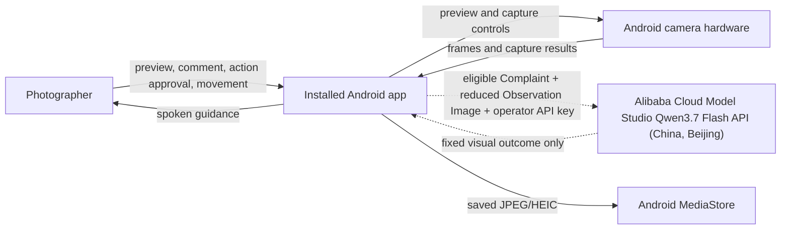
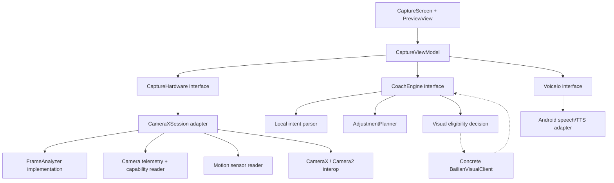

# Photo Helper — Android Technical Architecture

Status: implemented; physical-device qualification pending
Last reviewed: 2026-08-04
Audience: Android engineers, backend engineers, hackathon judges, and technical reviewers

Companion documents: [Android Product and Interaction Design](ANDROID_PRODUCT_DESIGN.md) and [ADR 0004 — Call Bailian Qwen directly from the private demo app](../docs/adr/0004-call-bailian-qwen-directly-from-private-demo.md)

## 1. Executive decision

Build one native Android camera app in Kotlin. Use CameraX for preview, capture, exposure compensation, focus, and zoom; use Camera2 interop only for capability-gated ISO, shutter, and white-balance controls. Run speech recognition, frame measurements, face detection, intent parsing, planning, camera control, and verification locally. For two visually ambiguous complaint families, the app sends one reduced Observation Image to Qwen `qwen3.7-flash-2026-07-15` through Alibaba Cloud Model Studio (Bailian) in China (Beijing), using a disposable API key entered on the operator's own device.

There is no owned backend, public account system, or provider abstraction. This is deliberately a private single-device hackathon architecture, not a production credential-distribution design. The model returns only a fixed Visual Hint; the Android app—not the model—computes, validates, applies, and verifies every camera change. If the key, network, or model is unavailable, the same local clarification remains usable.

The product loop is:

```text
observe → hear/read complaint → interpret → propose → obtain action approval
        → act through camera controls → observe again → confirm or recover
```

This is an agent because it closes the observe–act–verify loop. A chat response without execution or verification is not considered successful.

Judge-facing disclosure:

> This private demo uses Android on-device speech and face/frame analysis plus Qwen3.7 Flash through Alibaba Cloud Model Studio for selected visual interpretation. Qwen returns a fixed semantic label; camera decisions and verification stay on this phone.

### Selected stack

| Area | Decision |
|---|---|
| Language | Kotlin |
| UI | Jetpack Compose, single `Activity` |
| Camera | CameraX `Preview`, `ImageCapture`, and `ImageAnalysis` |
| Advanced controls | Experimental `Camera2CameraControl`/`Camera2CameraInfo`, isolated behind capability checks |
| Face analysis | Bundled ML Kit face detector in `FAST` mode |
| Body pose | Deferred; enable ML Kit Pose only for full-body coaching after the portrait MVP works |
| Orientation | Android rotation-vector/gravity sensors |
| Voice input | Push-to-talk on-device `SpeechRecognizer` only; typed input always available |
| Voice output | Android `TextToSpeech`, plus matching on-screen text and haptics |
| Agent reasoning | Deterministic local parser/planner plus a direct Qwen visual-only enum hint for two families |
| Persistence | No coaching/history database; photos use `MediaStore`; settings store accessibility flags and an Android-Keystore-encrypted demo API key |
| Dependency injection | Manual constructor wiring; no Hilt for one screen |
| Gradle structure | One `:app` module and one demo artifact; packages provide locality |
| Minimum Android version | API 31 (Android 12), enabling explicit on-device speech and scoped-storage-only support |
| Target/compile SDK | Latest stable SDK installed when implementation begins; do not freeze this architecture document to a Play-policy date |

## 2. Scope

### MVP supports

- Rear-camera capture; person-specific coaching requires exactly one stable detected face as the Coaching Subject, while exposure/color capture does not require a face.
- Live preview and still photo capture.
- Typed comments on every device; push-to-talk when an installed on-device English recognizer is available.
- Four locally understood complaint families:
  - too bright / too dark;
  - too blue / too yellow;
  - face too large / too small;
  - subject misplaced / phone not level.
- One-tap application of supported setting changes.
- Spoken, visual, and haptic positional guidance.
- Verification after the setting or position changes.
- Offline behavior for the common, measurable intents.
- Local clarification for ambiguous, unsupported, or novel wording.

Across supported devices, the executable baseline is exposure compensation, face-size guidance, and phone/subject-position guidance. Color comments are always understood locally, but warm/cool application is capability-gated; an unsupported camera reports that the control is unavailable instead of recommending a software change it cannot apply.

### Explicit non-goals for the hackathon

- Video recording.
- Editing an already captured image.
- Multiple-person pose coaching.
- A general photography chatbot.
- Continuous cloud video upload.
- Generative retouching, face reshaping, or beauty filters.
- A social feed, accounts, sync, or a coaching-history database.
- Feature parity with the phone manufacturer's default camera.
- Cross-platform architecture.

If a user comments after taking a photo, the proposed camera setting applies to the next capture. The UI must say “Apply for retake,” not imply that ISO or shutter can modify pixels already captured.

## 3. Quality targets

These are product targets, not claims about every Android device.

| Property | MVP target |
|---|---:|
| Camera preview visible after permission grant | under 1.5 s on the demo device |
| Local comment-to-recommendation latency | under 300 ms |
| Visual request latency | target p50 under 2 s; hard timeout at 5 s |
| Setting application visible in preview | under 500 ms after tap |
| Guidance measurement rate | 4 Hz, independent of display frame rate |
| Spoken-instruction rate | no more than one instruction every 1.5 s |
| Analysis resolution | 640–720 px long edge; face-eligible frames require a detected box at least 100×100 analysis pixels |
| Conditional visual request body | at most 450 KiB JSON; comment at most 300 characters; decoded JPEG at most 300 KiB |
| Crashes or blocked shutter after analysis failure | zero tolerated |

## 4. System context



The app remains usable when Qwen or Alibaba Cloud Model Studio is unavailable: the same local clarification stays on screen and the shutter remains usable.

## 5. In-app architecture



### Why these seams exist

- `CaptureHardware` has a CameraX adapter for production and a deterministic fake for state-machine tests. It hides device fragmentation and asynchronous camera operations behind one interface.
- `CoachEngine` is the main deep module. One call covers language interpretation, evidence checks, capability-aware planning, explanation, and a verification target.
- `CoachEngine` cannot perform network I/O. It can return local clarification plus visual eligibility metadata; the ViewModel may then call the single concrete `BailianVisualClient` when the operator has configured the demo key.
- `VoiceIo` isolates Android speech lifecycles and provides a fake for ViewModel tests.
- `FrameAnalyzer`, capability reading, sensor fusion, and action planning are implementation details. They are not exposed to the UI as independent shallow interfaces.

## 6. Module interfaces

The snippets describe interfaces and invariants. They are not intended to be copied unchanged before the Gradle project and exact CameraX version exist.

### 6.1 Capture hardware

```kotlin
interface CaptureHardware {
    val capabilities: StateFlow<CameraCapabilities>
    val observation: StateFlow<FrameObservation?>
    val status: StateFlow<CameraStatus>

    suspend fun apply(adjustment: CameraAdjustment): ApplyResult
    suspend fun focusAt(xFraction: Float, yFraction: Float): ApplyResult
    suspend fun resetAutomaticControls(): ApplyResult
    suspend fun capture(): CaptureResult
}
```

Interface invariants:

- `apply` validates every value against the active camera's current capability ranges.
- `apply` returns only after the repeating capture result reflects the requested control, or returns a typed failure.
- A newer adjustment cancels an older in-flight adjustment.
- `capture` is rejected while the camera is unbound, never silently queued.
- `observation` is the latest analysis result; slow consumers do not accumulate old frames.
- `resetAutomaticControls` clears Camera2 overrides before re-enabling CameraX AE/AWB behavior.
- No method exposes `ImageProxy`, `CaptureRequest`, or ML Kit types outside the module.

`CameraXSession` also has an Activity-owned `bind(lifecycleOwner, surfaceProvider)` function. It is deliberately not called from the ViewModel, preventing lifecycle objects from entering UI state.

### 6.2 Coaching engine

```kotlin
interface CoachEngine {
    fun evaluateLocal(input: CoachingInput): LocalDecision
    fun continueWithVisualHint(
        complaintId: ComplaintId,
        family: VisualFamily,
        hint: VisualHint,
        freshInput: CoachingInput
    ): LocalDecision
    fun verify(
        target: VerificationTarget,
        current: FrameObservation
    ): VerificationResult
}
```

Interface invariants:

- It returns one primary action, not a menu of simultaneous instructions.
- It never proposes an action unsupported by `input.capabilities`.
- A setting recommendation includes the exact computed adjustment and a reversible reset path.
- A movement recommendation includes a measurable target and a safety preamble when it asks the user to walk.
- Ambiguous, unsupported, negated, or polarity-conflicted language returns a clarification or limitation instead of an executable action. Every supported setting change uses one `Apply` tap; coached focus uses one visible target tap; physical movement uses `Start guidance`.
- `verify` is pure and deterministic.
- A clear-direction complaint may express a `UserPreference` even when defect evidence is absent. In that case the recommendation labels the mismatch and offers a reversible directional change; it does not claim a `MeasuredDiagnosis`.
- A diagnosis uses `DefectVerification`. A preference uses `EffectVerification` followed by user confirmation; applying the requested effect is not presented as objective quality improvement.
- `evaluateLocal` performs no network I/O. It may return `Clarification(question, chips, visualEligibility)` only when a configured visual interpretation could change a useful result.
- `continueWithVisualHint` treats the hint as semantic input, checks Complaint/provenance identity, and reruns the ordinary polarity, evidence, capability, planning, and verification rules.

### 6.3 Direct Qwen/Bailian visual boundary

```kotlin
data class VisualEligibility(
    val complaintId: ComplaintId,
    val family: VisualFamily,
    val origin: ObservationOrigin,
    val eligibilitySnapshotId: ObservationId
)

class BailianVisualClient {
    suspend fun interpret(request: VisualRequest, apiKey: CharArray): VisualResult
}
```

The local parser—not Qwen—classifies wording. `VisualEligibility` contains no pixels and causes no I/O. When the operator has entered and enabled a demo API key, the ViewModel freezes one qualifying image and calls the concrete `BailianVisualClient` directly. The client has one hard-coded provider/model contract and cannot call Android controls. Clear the temporary key character buffer after request construction.

### 6.4 Voice I/O

```kotlin
interface VoiceIo {
    suspend fun listenOnce(locale: Locale): VoiceResult
    fun speak(text: String, utteranceId: String)
    fun stopSpeaking()
    fun close()
}
```

Push-to-talk is capability-dependent rather than a release gate. On microphone tap, call `isOnDeviceRecognitionAvailable` and use `createOnDeviceSpeechRecognizer` only. Cloud-backed default speech recognition is not allowed in the MVP. Before first use, disclose: `Android transcribes voice on this device. Photo Helper does not store or send your audio. Android may download the English speech model.` If the on-device model or requested language is unavailable, retain typed input and let an explicit microphone tap request the platform model download; never fall back silently to a network recognizer.

## 7. Domain data

### 7.1 Frame observation

```kotlin
data class FrameObservation(
    val timestampMs: Long,
    val meanLuma: Float,
    val highlightClipFraction: Float,
    val shadowClipFraction: Float,
    val chromaBlueBias: Float?,
    val faces: List<FaceObservation>,
    val primaryBody: BodyObservation?,
    val deviceRollDegrees: Float?,
    val devicePitchDegrees: Float?,
    val motionScore: Float,
    val sourceWidth: Int,
    val sourceHeight: Int
)
```

Coordinates are normalized to the displayed preview after rotation and crop. The selected ML Kit Face API exposes no overall detection score; smile/eye-open probabilities, when enabled, are expression classifications and are not eligibility evidence. Measurements derived from stale frames older than 750 ms are not executable evidence.

### 7.2 Camera capabilities and telemetry

```kotlin
data class CameraCapabilities(
    val exposureCompensationRange: IntRange,
    val exposureCompensationStepEv: Float,
    val supportsManualExposure: Boolean,
    val isoRange: IntRange?,
    val exposureTimeNsRange: LongRange?,
    val supportsManualColorCorrection: Boolean,
    val supportedAwbModes: Set<AwbMode>,
    val zoomRatioRange: ClosedFloatingPointRange<Float>,
    val supportsFocusMetering: Boolean,
    val hardwareLevel: HardwareLevel
)

data class CameraTelemetry(
    val exposureCompensationIndex: Int,
    val iso: Int?,
    val exposureTimeNs: Long?,
    val whiteBalanceMode: AwbMode?,
    val calibratedWhiteBalanceTemperatureK: Int?,
    val zoomRatio: Float
)
```

Manual controls are enabled only when the request keys, ranges, and hardware level support them on the active physical camera. Switching lenses invalidates capabilities and telemetry; the planner must recompute before Apply becomes enabled.

### 7.3 Intent vocabulary

The local parser/planner uses this broader semantic vocabulary:

```text
EXPOSURE_DARKER      EXPOSURE_BRIGHTER
FREEZE_MOTION        REDUCE_NOISE
WHITE_BALANCE_WARMER WHITE_BALANCE_COOLER RESET_WHITE_BALANCE
FACE_OCCUPANCY_LOWER FACE_OCCUPANCY_HIGHER
PLACE_SUBJECT_FRAME_LEFT PLACE_SUBJECT_FRAME_RIGHT
FRAME_HIGHER             FRAME_LOWER        LEVEL_FRAME
CLARIFY              UNSUPPORTED
```

The conditional VLM has a much smaller visual-only vocabulary defined in section 10. It does not select arbitrary ISO, shutter, white-balance, zoom, or movement values.

These values are `FrameGoal`s in unmirrored saved-image coordinates, not movement instructions. The MVP planner emits only photographer/camera actions:

```text
PAN_CAMERA_LEFT          PAN_CAMERA_RIGHT
TILT_CAMERA_UP           TILT_CAMERA_DOWN
ROLL_CAMERA_CLOCKWISE    ROLL_CAMERA_COUNTERCLOCKWISE
STEP_PHOTOGRAPHER_BACK   STEP_PHOTOGRAPHER_FORWARD
RAISE_CAMERA             LOWER_CAMERA
```

For example, `PLACE_SUBJECT_FRAME_LEFT` maps to `PAN_CAMERA_RIGHT`, and verification expects the Coaching Subject's normalized x-coordinate to decrease. TTS always speaks the `GuidanceAction`, including its actor: “Aim the phone slightly right.” Subject-body movement, front-camera mirroring, and tripod actor switching are outside the MVP.

### 7.4 Executable adjustments

```kotlin
sealed interface CameraAdjustment {
    data class ExposureCompensation(val targetIndex: Int) : CameraAdjustment
    data class ManualExposure(val iso: Int, val exposureTimeNs: Long) : CameraAdjustment
    data class WhiteBalance(
        val mode: AwbMode,
        val calibratedGains: ColorGains? = null
    ) : CameraAdjustment
    data class ZoomRatio(val ratio: Float) : CameraAdjustment
}

sealed interface RecommendationAction {
    data class ApplySetting(val adjustment: CameraAdjustment) : RecommendationAction
    data class GuidePosition(val target: VerificationTarget) : RecommendationAction
    data class AskClarification(val question: String) : RecommendationAction
    data class ExplainOnly(val reason: String) : RecommendationAction
}
```

Every recommendation also carries a basis:

```kotlin
enum class RecommendationBasis {
    MEASURED_DIAGNOSIS,
    USER_PREFERENCE
}
```

When the basis is `USER_PREFERENCE`, contradictory frame evidence becomes tradeoff copy, not an automatic refusal. Unsupported controls and unsafe physical movement remain non-executable.

Each recommendation carries `RecommendationProvenance`: observation ID/time, camera session ID, active camera/lens ID, capability revision, telemetry revision, live-or-review origin, Subject Lock ID when relevant, basis, and creation time.

Apply preconditions:

- Camera phase is `READY`; no capture or setting application is in flight.
- Camera session, lens, capability revision, and any required Subject Lock still match.
- Current telemetry exists and the proposed value remains within capability ranges.
- Live `MEASURED_DIAGNOSIS` evidence is no older than 750 ms. Stale evidence reruns the same Complaint against the latest observation and replaces or withdraws the recommendation.
- Live `USER_PREFERENCE` direction may remain for at most 30 seconds in the same foreground session, but its concrete adjustment is always replanned from fresh observation and telemetry.
- Backgrounding, a camera/lens/session change, or Subject Lock loss invalidates every live recommendation.
- Actual captured pixels in an open Capture Review do not age, but an `Apply for retake` adjustment is still replanned against the current camera. After backgrounding, it remains visible but disabled until replanning succeeds.

`AdjustmentPlanner` performs the semantic-to-device mapping. Examples:

- `EXPOSURE_DARKER`: start with `−0.7 EV`, quantize to the device step, clamp to its range, then verify reduced clipping.
- `FREEZE_MOTION`: treat the explicit `Freeze movement` choice as a preference; bare `blurry` first clarifies `Freeze movement` versus `Focus missed`. Apply only on a capability-probed camera with stable exposure telemetry and the calculation below.
- `REDUCE_NOISE`: lower ISO only when a longer shutter is safe according to `motionScore`; otherwise explain the tradeoff instead of applying a lossy change.
- `WHITE_BALANCE_WARMER`: use a tested AWB preset or calibrated color gains only if the active camera supports them; otherwise offer Reset AWB.

For the capability-gated manual-exposure showcase, a `FREEZE_MOTION` plan targets a bounded two-stop shutter improvement:

```text
idealExposureTime = currentExposureTime / 4
targetExposureTime = quantizeToSupported(idealExposureTime)
targetISO = quantizeToSupported(
    currentISO * currentExposureTime / targetExposureTime
)
```

Clamp ISO to both the reported sensor range and a calibrated demo-device noise ceiling. From 1/120 s at ISO 400, this yields approximately 1/500 s at ISO 1600. If the full compensation exceeds the ceiling, compute the fastest shutter that preserves brightness at that ceiling. Offer Apply only when the result is at least one stop faster and quantization predicts no more than 0.3 EV brightness loss; show the exact before/after values and `Freezes more motion; adds noise.` Otherwise return `Add light or ask the subject to slow down` advice without Apply.

When the manual showcase passes its device gate, the comparison begins from a deliberately blurry saved photo in Capture Review, not a preview frame. `Apply for retake` uses its actual capture telemetry, revalidates the same camera, and acknowledges the new settings in the repeating capture result. After the retake is saved, decode both saved images, require the same lens/subject/region and the comparability bounds below, align the subject crop, and compare a simple on-device gradient-sharpness score. A 15% or greater improvement permits `Subject detail is sharper.` This metric cannot distinguish motion blur from missed focus, so the app never claims `motion blur fixed`. Failure of the manual gate hides this optional feature; it does not fail the core demo.

Verification reports three separate outcomes:

- `Applied`: the camera future/capture result acknowledges the requested control.
- `EffectObserved`: Comparable Observations show the predicted metric changed in the expected direction.
- `RequestSatisfied`: a diagnosis reaches its target, or the photographer confirms `Yes, closer` after a preference effect.

For setting comparisons, use the same camera/lens and Subject Lock/region, roll/pitch delta under 2°, subject center/size drift under 5%, low scene motion, and three stable samples before and after 3A settles. If these conditions fail, the visual evidence is incomparable. `Applied` plus incomparable evidence says `Setting applied, but the scene changed, so I can’t verify the visual result.` Comparable but unchanged says `Setting applied, but I don’t see the expected change yet.` An observed direction that has not reached its target says so without declaring success.

## 8. Orthogonal UI state

Camera lifecycle and coaching work are independent dimensions; one mutually exclusive state enum cannot describe “camera ready while guidance is active.”

```kotlin
data class CaptureUiState(
    val cameraPhase: CameraPhase,
    val coachingPhase: CoachingPhase,
    val review: SavedCapture? = null
)

enum class CameraPhase { STARTING, READY, CAPTURING, REVIEWING, BLOCKED }

enum class CoachingPhase {
    IDLE,
    LISTENING,
    INTERPRETING,
    REQUESTING_VISUAL_INTERPRETATION,
    RECOMMENDATION,
    APPLYING,
    GUIDING,
    VERIFYING,
    TRANSIENT_ERROR
}
```

Only `CaptureViewModel` transitions these fields. Camera, voice, and network callbacks become typed events processed serially in `viewModelScope`. Each asynchronous operation is owned by a cancellable job and, where relevant, the active Complaint identity so a cancelled or superseded result cannot mutate state.

The shutter is enabled only when `cameraPhase == READY` and `coachingPhase != APPLYING`:

| Coaching phase on shutter | Required behavior before capture |
|---|---|
| `IDLE` | Capture directly |
| `LISTENING` | Stop recognizer and discard partial speech |
| `INTERPRETING` | Cancel local work and invalidate the active operation |
| `REQUESTING_VISUAL_INTERPRETATION` | Cancel the Qwen/Bailian call, release the Observation Image, then capture |
| `RECOMMENDATION` | Clear the unapplied recommendation |
| `GUIDING` / `VERIFYING` | Stop TTS/haptics, release Subject Lock, and end verification |
| `TRANSIENT_ERROR` | Clear the error |
| `APPLYING` | Shutter disabled until camera acknowledgement or failure; do not queue a press |

Capture takes priority over cancellable coaching. `STARTING`, `CAPTURING`, `REVIEWING`, and `BLOCKED` camera phases disable the shutter. Coaching work never survives into a new capture implicitly.

`REQUESTING_VISUAL_INTERPRETATION` owns one closeable Observation Image and request job under `try/finally`. A shutter press, Back, a new Complaint, lifecycle stop, timeout, or process death cancels the call, releases the image, and returns to the same local clarification; the shutter is never queued. Late callbacks must match the active Complaint lifecycle, provenance, and current state or are discarded.

`REVIEWING` owns a `SavedCapture` containing the MediaStore URI, review image, actual-capture observation, captured telemetry, and applied baseline. The camera remains lifecycle-bound for a quick retake, but the review obscures preview, pauses live analysis, and hides the shutter. A review-origin recommendation retains its origin until Apply or dismissal.

## 9. Camera pipeline

### 9.1 Bound CameraX use cases

- `Preview` renders into `PreviewView` hosted through Compose `AndroidView`.
- `ImageCapture` writes the final photo.
- `ImageAnalysis` uses `STRATEGY_KEEP_ONLY_LATEST`; it must close each `ImageProxy` in `finally`.
- Target analysis is 640×480 or the closest supported 4:3 size. The preview and capture retain the selected UI aspect ratio.

Do not block the analyzer waiting for speech, network, or TTS. The analyzer produces an immutable observation and returns.

### 9.2 Analysis schedule

1. Read luma/chroma statistics from the YUV planes every 250 ms.
2. Run face detection on the same sampled frame using ML Kit `FAST` mode.
3. Run pose detection only while a full-body intent is active.
4. Merge device roll/pitch from the latest rotation-vector sample.
5. Publish one `FrameObservation` to a conflated `StateFlow`.

If a detector is still busy, discard the new analysis request. Fresh guidance matters more than processing every frame.

### 9.3 Measurements

- Brightness: 64-bin luma histogram computed over a subsampled grid.
- Highlight clipping: fraction of sampled luma at or above a calibrated high threshold.
- Shadow clipping: equivalent low threshold.
- Blue cast: average chroma bias after excluding near-black, near-white, and highly saturated pixels. Treat it as weak evidence; blue scenes are legitimate.
- Face size: face-box width divided by displayed-preview width.
- Face position: face-box center relative to safe composition regions.
- Horizon/level: device roll; image-derived horizon is a later fallback.
- Step-back progress: decreasing face-size trend over several observations. The app does not claim to measure physical distance.

Thresholds belong in one `CoachThresholds` value object so they can be calibrated on the demo device. This is physical-camera tuning, not speculative configuration.

Regional exposure is outside the MVP. `EXPOSURE_DARKER` and `EXPOSURE_BRIGHTER` diagnose only whole-frame luma/clipping. “Background too bright” or “my face is dark” produces the fixed clarification `Whole photo`, `Person/face`, `Background`; only `Whole photo` can lead to global EV Apply. The other choices receive advisory tradeoff copy because global EV changes both subject and background.

### 9.4 Coaching Subject qualification

- Never treat `faces[0]`, the largest face, or the closest face as a stable subject.
- With one detected face, keep it as a candidate until three consecutive analyzed samples span at least 500 ms, every box is at least 100×100 analysis pixels, and consecutive boxes satisfy IoU/center/scale continuity. Then create a session-local Subject Lock; require the same ML Kit tracking ID when it is present, but do not require the optional ID.
- With zero faces, withhold person-specific coaching and ask the photographer to point at the person.
- With multiple faces, pause or withhold person-specific coaching and say `I see more than one person. Frame only the person you want help with.` There is no tap-to-select UI in the MVP.
- A newly entering face never inherits an existing lock.
- Use the same geometric continuity to bridge a missing optional tracking ID; it is not identity recognition.
- If the locked face is missing for more than 750 ms, pause speech and verification.
- Resume only if the same track or one unambiguous geometric continuation returns within three seconds.
- After three seconds, or whenever a second candidate is present, abort guidance and require exactly one stable face again.

Detection order may change without affecting the Coaching Subject.

### 9.5 Setting application

Use high-level CameraX controls first:

- exposure compensation;
- zoom;
- AF-only tap-to-focus at a user-selected visible preview point, capability-checked before display and again on tap; this path does not require face detection;
- torch when explicitly requested in a later phase.

Use Camera2 interop only for manual ISO, shutter, or white balance. The interop interface is marked experimental; its options override CameraX controls and may disturb 3A behavior.

Before the first coached control Apply in a bound-camera session, record `ControlBaseline`: the complete observed automatic/manual state keyed by camera-session ID, active physical/lens ID, and capability revision. Keep it as Reset's target across chained Applies. Separately update `lastCommittedControlState` after each capture-result acknowledgement.

Each Apply is a transaction:

1. validate a complete desired state against the current key and capability ranges;
2. clear incompatible fields during a mode change—AE-to-manual clears EV compensation, and manual-to-AE clears sensor exposure/ISO overrides;
3. submit one complete request-options bundle and await the future plus repeating-capture-result acknowledgement;
4. commit only after acknowledgement;
5. on failure or timeout, restore `lastCommittedControlState`; if that rollback is not acknowledged, clear Camera2 overrides, force safe AE/AWB automatic controls, and report the failure.

Reset restores `ControlBaseline`, not merely the previous action. Capture Review retains both snapshots only while the same camera key remains bound, and `Apply for retake` revalidates them. Lens change, capability revision, camera unbind, or app background invalidates both snapshots and clears overrides. Reset is enabled only when its key matches the current camera; a stale baseline is never applied to a new session.

Do not mix CameraX exposure compensation with a Camera2 request that disables AE.

Android Camera2 does not expose one universal “set Kelvin” control. Warm/cool application must use a supported AWB mode or device-tested color-correction gains. A Kelvin value may be shown only when the active-camera adapter has a calibrated mapping; otherwise the UI says `Warmer`, `Cooler`, or `Auto`.

### 9.6 Capture and storage

- Use `ImageCapture.takePicture(OutputFileOptions, …)`.
- Write to `MediaStore.Images` under `Pictures/PhotoHelper`; on the supported API 31+ range, no broad storage permission is needed for media created by the app.
- Bound capture completion to 15 seconds. Cancellation restores the ready/shutter state with retry guidance; a late save callback deletes its orphaned MediaStore row.
- Record the applied settings in EXIF only if the capture result supplies them reliably.
- A failed coaching analyzer must never disable the shutter.

After a successful save, decode the actual saved pixels at analysis resolution and enter `ReviewingCapture`; do not use the last preview frame as capture truth. Capture telemetry comes from the still-capture result or EXIF and is marked unknown when unavailable. `Done` dismisses review, while `Retake` returns unchanged to preview. Both retain the already-saved original and perform no second write or deletion. Review copy states `Original remains saved`. A post-capture comment uses actual captured pixels and available telemetry as its `RetakeBaseline`. `Apply for retake` revalidates the active camera, applies a plan relative to that baseline, returns to live preview, and verifies against fresh observations. A lens or capability change invalidates the old plan and forces recomputation.

## 10. Local coaching and direct Qwen interpretation

### 10.1 Local decision first

The Android parser owns wording classification:

```text
"too bright", "washed out", "highlights gone" → EXPOSURE_DARKER
"too blue", "cold", "looks cool"             → COLOR_CAST / WARMER preference
"face occupies too much frame"               → FACE_OCCUPANCY_LOWER
"face too big", "too close"                  → FACE_SIZE_AMBIGUOUS
"crooked", "not straight"                    → LEVEL_FRAME
```

Unknown, elliptical, negated, unsupported, or novel wording produces app-owned clarification chips and no request. Qwen is a visual disambiguator, not a language fallback. One complete Complaint replaces the prior lifecycle; literal Reset remains local.

When a demo API key is configured, `CoachEngine.evaluateLocal` may mark only `COLOR_CAST` or `FACE_SIZE_AMBIGUOUS` as visually eligible. `Person looks short` remains local clarification/advice until a later pose-backed phase.

| Family | Required before a request | Returned result and authority |
|---|---|---|
| `COLOR_CAST` | Exact whole-frame warm/cool phrase and polarity; current color metric; at least 30% usable pixels; mean luma `0.10..0.90`; highlight/shadow clipping each below `0.15`; chroma bias between calibrated weak/strong thresholds. | Prompt/schema v2 returns `WHITE_BALANCE_WARMER` or `WHITE_BALANCE_COOLER`. Apply still requires fresh comparable color evidence and tested WB capability; otherwise advice only. |
| `FACE_SIZE_AMBIGUOUS` | Exactly one geometrically stable Subject Lock across three samples/500 ms; face box at least 100×100 analysis pixels and 90% visible; occupancy `0.25..0.70`. | Prompt/schema v3 returns only boolean `distortionVisible`. Android maps `false` to `FACE_OCCUPANCY_LOWER` and `true` to `CLOSE_PERSPECTIVE_ADVISORY`; the model never selects those labels. Occupancy may start one-step guidance after fresh evidence, while perspective remains advice only. |

### 10.2 Demo API key

Settings contains a password-style `Alibaba Cloud Model Studio API key` field, `Test key`, `Visual AI enabled`, and `Clear key`. The field does not use autofill, does not enter `SavedStateHandle`, and never logs or displays the full saved value. Generate a non-exportable AES/GCM key in `AndroidKeyStore`; store only the encrypted API key ciphertext and IV in private `SharedPreferences`, and set `android:allowBackup="false"`. Clear removes ciphertext and the Keystore alias. This reduces accidental disclosure but is not production-grade protection against a compromised device or runtime instrumentation.

Use a disposable Alibaba Cloud Model Studio key with a low account quota, keep the APK on the operator's device, and revoke/rotate the key after the demo. The direct-call risk and China (Beijing) processing boundary are recorded in ADR 0004.

Fixture/evaluation scripts read `EVALUATION_MODEL_NAME` and `EVALUATION_MODEL_KEY` from the host environment or an ignored `.env` file. Do not commit `.env`, print the key, or copy either environment value into Android `BuildConfig`, resources, source, or the APK; desktop environment variables are unavailable to an installed app at runtime. The installed app uses the fixed non-secret model constant and a separately entered runtime key.

### 10.3 Observation Image lifecycle

After the final text/voice Complaint passes visual eligibility, the app automatically freezes the newest live analysis frame no older than 500 ms, or uses the exact saved pixels in Capture Review. Normalize to the visible saved-image orientation/crop, cap the long edge at 768 px, encode JPEG at quality 70, and require at most 300 KiB. Close `ImageProxy` immediately.

The reduced bitmap/JPEG/base64 exists only in memory and never enters MediaStore, app files/cache, a database, saved state, analytics, crash reporting, or logs. CameraX owns and wipes the latest live observation buffer; each request coroutine owns and wipes its private copies under `try/finally`. Cancellation, timeout, result/failure, backgrounding, or process death releases them. No continuous preview streaming occurs.

### 10.4 Direct API contract

`BailianVisualClient` calls `POST https://dashscope.aliyuncs.com/compatible-mode/v1/chat/completions`, Alibaba Cloud Model Studio's OpenAI-compatible China (Beijing) endpoint, with `Authorization: Bearer <operator-entered-key>` and one JSON body:

```json
{
  "model": "qwen3.7-flash-2026-07-15",
  "messages": [{
    "role": "user",
    "content": [
      {"type": "image_url", "image_url": {"url": "data:image/jpeg;base64,..."}},
      {"type": "text", "text": "Prompt v3: family=FACE_SIZE_AMBIGUOUS; comment=face looks too big; inspect facial proportions only; return JSON with boolean distortionVisible or a permitted clarification"}
    ]
  }],
  "enable_thinking": false,
  "temperature": 0,
  "stream": false,
  "response_format": {"type": "json_object"}
}
```

Alibaba Cloud's OpenAI-compatible Chat documentation explicitly permits a URL or Base64-encoded Data URL in `image_url.url`; its structured-output documentation requires the prompt to mention JSON and `response_format.type` to be `json_object`. Qwen3.7 Flash supports image input and structured output in non-thinking mode, so the client sets `enable_thinking` to `false` and `temperature` to `0`, then still validates the returned content independently.

Bailian's OpenAI-compatible response uses a provider-generated `id` and `object: "chat.completion"`; it does not echo a client `request_id`. Abort after five seconds and never retry automatically. Allow at most six visual calls per minute in the app and rely on the Alibaba Cloud account quota for cost control. Accept a nonblank provider `id`, exact `object` and model identifiers, one choice only, `finish_reason == stop`, `role == assistant`, no tool calls, absent/empty reasoning content and refusal, and content at most 512 bytes. Trim surrounding whitespace only; reject fences, trailing prose, unknown union keys, partial JSON, and family-disallowed labels. Standard response metadata such as `usage` and `created` may be present but never reaches the planner.

A minimal accepted provider envelope is:

```json
{
  "id": "chatcmpl-provider-generated",
  "object": "chat.completion",
  "model": "qwen3.7-flash-2026-07-15",
  "choices": [{
    "finish_reason": "stop",
    "message": {
      "role": "assistant",
      "content": "{\"schemaVersion\":3,\"outcome\":\"INTENT\",\"distortionVisible\":false}"
    }
  }]
}
```

The provider content is a family-specific strict union. `COLOR_CAST` uses Prompt/schema v2:

```json
{"schemaVersion":2,"outcome":"INTENT","intent":"WHITE_BALANCE_WARMER"}
```

or:

```json
{"schemaVersion":2,"outcome":"CLARIFY","reason":"SUBJECT_UNCLEAR"}
```

Color `INTENT` requires `intent` and allows only `WHITE_BALANCE_WARMER|WHITE_BALANCE_COOLER`.

`FACE_SIZE_AMBIGUOUS` uses Prompt/schema v3 and asks one visual question: whether close/wide-angle perspective distortion is visible in facial proportions. A large face, tight crop, or proximity alone is not distortion evidence. Its accepted values are:

```json
{"schemaVersion":3,"outcome":"INTENT","distortionVisible":true}
```

```json
{"schemaVersion":3,"outcome":"INTENT","distortionVisible":false}
```

or:

```json
{"schemaVersion":3,"outcome":"CLARIFY","reason":"SUBJECT_UNCLEAR"}
```

`distortionVisible` must be a JSON boolean. Android—not Qwen—maps `true` to `CLOSE_PERSPECTIVE_ADVISORY` and `false` to `FACE_OCCUPANCY_LOWER`. This removes the output-label ordering that biased the earlier face enum contract. For `CLARIFY`, `reason` is required and `intent`/`distortionVisible` are forbidden; reasons remain `VISUAL_INSUFFICIENT|SUBJECT_UNCLEAR|SCENE_CONFOUND`, with schema v2 for color and v3 for face size. Refusal, timeout, malformed output, or model mismatch is unavailable, not `CLARIFY`. No provider prose is rendered.

Every card derived from an accepted Visual Hint displays `AI-interpreted by Qwen via Alibaba Cloud; camera controls checked on device`. The label persists after loading and is announced after the card headline. Local-only cards never show it.

### 10.5 Provider processing and scope

The operator explicitly enables direct Alibaba Cloud Model Studio processing by entering the key and turning on `Visual AI enabled`. Each eligible request then runs automatically against the China (Beijing) endpoint. Alibaba Cloud's China privacy notice says submitted data is not used for model training and that model/application call data is stored as required by applicable law. The app makes no zero-retention, deletion, or broader residency claim. The Alibaba request contains no audio, EXIF, content URI, face landmarks, tracking ID, hardware ID, or local metrics. Bundled ML Kit inputs/results remain on-device, while its documented SDK diagnostics/usage collection is disclosed separately. The operator controls the staged device and is responsible for what appears in its camera frame.

This is not a public-app security/privacy design. Before wider distribution, move the key behind an authenticated backend or use an on-device model, add a proper consent/bystander policy, and perform security/privacy review.

### 10.6 Provenance and stale results

The active visual operation keeps the exact Complaint identity, origin, camera/session provenance, and relevant image/scene evidence locally. The synchronous HTTP response belongs to that operation; the provider-generated response `id` is validated as nonblank but is not treated as an echoed client correlation token.

For live preview, discard after a new/edited Complaint, shutter/capture/review entry, lifecycle stop, camera/session/lens/viewport change, analysis discontinuity, Subject Lock change, face count leaving one for person-specific cases, subject loss, face-box IoU below `0.70`, face-center movement above `0.08` frame, face-scale change above 10%, or color-direction/chroma material change. A surviving result is only a Visual Hint: obtain a fresh local observation no older than 750 ms and run the normal planner. It never enables Apply by itself.

For Capture Review, bind to SavedCapture ID/URI, digest of the exact reduced pixels, and RetakeBaseline. Dismissal/Retake/Done, a new Complaint/capture, background, or digest mismatch invalidates it. `Apply for retake` requires saved-image evidence plus freshly validated camera/lens capabilities.

### 10.7 Evaluation

The live fixture gate exposed label-order bias when the earlier face contract asked Qwen to choose between two app intent names. That result is rejected evidence, not a shippable model behavior. The final Prompt v3 asks the binary distortion question, returns a boolean, and leaves intent mapping to Android. Rerun the exact API smoke plus ordinary, adversarial, and parser-fault fixtures against both boolean values and clarification; require every call under five seconds, 100% family/schema enforcement, zero wrong-direction executable outcomes, and graceful local fallback on key/network/provider failure.

For post-hackathon evidence, use 80 development pairs and a sealed 40-case holdout, plus 54 adversarial cases covering prompt injection, visible text, no/multiple/wrong faces, color confounders, crop/mirror/rotation, provider refusal/truncation, response drift, and family-disallowed labels. Treat a 12-person/48-trial study as exploratory rather than production proof.

The repeatable evaluation harness at `scripts/qwen-live-smoke.py` writes JSONL with run/time, source commit, expected/returned model, prompt/schema hash, fixture/content hash, expected family/labels, raw fixture-only response, parsed label, latency, rejection reason, and pass/fail. It stores no additional image copy or API key. The bounded live-smoke results are recorded in `test-fixtures/README.md`.

## 11. Positional guidance

A movement recommendation is converted into a `VerificationTarget`, not an unbounded stream of prose.

Examples:

| Intent | Initial instruction | Verification metric | Completion |
|---|---|---|---|
| `FACE_OCCUPANCY_LOWER` | “I cannot inspect your path. Move only if you can independently verify it.” then one small step | face-width trend | target fraction reached for 500 ms |
| `PLACE_SUBJECT_FRAME_LEFT` | “Aim the phone slightly right.” | subject-center x decreases | center enters target band |
| `FRAME_HIGHER` | “Tilt the phone slightly down.” | pitch and subject position | both enter band |
| `LEVEL_FRAME` | “Rotate the phone a little clockwise.” | absolute roll | under 1.5° for 500 ms |

Guidance rules:

- Speak one instruction at a time.
- Do not say “keep going” more than twice without re-evaluating.
- Require a stable target across multiple frames to avoid oscillation.
- Use a short success earcon and haptic instead of another sentence.
- Stop guidance immediately when the user taps Cancel, backgrounds the app, or loses the subject.
- The app has no hazard detector and never infers that a path is safe. Each translational action card states the limitation and requires a per-action `Start one-step guidance` tap before movement.
- Ask for at most one small step, then stop and re-measure. Dismissal stops the action without moving or changing the camera.
- When Android touch exploration is active, do not offer walking instructions. Keep stationary pan/tilt/level guidance and advisory distance or capability-gated continuous-zoom alternatives.

“Face too big” is ambiguous. The app asks `Takes up too much frame` versus `Features look distorted`. The first selects measurable Face Occupancy coaching. The second identifies possible Close-Perspective Distortion and returns advisory copy—step back, then use a longer lens or zoom to restore framing—without a guided success claim.

## 12. Concurrency and lifecycle

- Main thread: Compose rendering, camera binding, SpeechRecognizer calls required by Android, and state dispatch.
- Camera executor: CameraX analysis callback and capture callback.
- Analysis dispatcher: histogram and ML Kit work; at most one analysis job at a time.
- IO dispatcher: direct Alibaba Cloud Model Studio HTTP call, key encryption, and MediaStore preparation.
- ViewModel scope: serialized product-state transitions.

Cancellation behavior:

- A new comment cancels the previous interpretation request.
- Backgrounding cancels listening, TTS, guidance, analysis jobs, and in-flight setting application.
- CameraX binding follows the Activity lifecycle.
- `SpeechRecognizer.destroy()` and `TextToSpeech.shutdown()` run when their adapter closes.
- Network timeout is five seconds; retry only after explicit user action.

## 13. Proposed source layout

```text
app/src/main/java/.../photohelper/
  MainActivity.kt
  AppGraph.kt                    # manual construction only
  capture/
    CaptureScreen.kt
    CaptureViewModel.kt
    CaptureUiState.kt
    CaptureHardware.kt
    CameraXSession.kt
    FrameObservation.kt
    CameraCapabilities.kt
  coach/
    CoachEngine.kt
    DefaultCoachEngine.kt
    CoachingModels.kt
    AdjustmentPlanner.kt
    Verification.kt
  voice/
    VoiceIo.kt
    AndroidVoiceIo.kt
  visual/
    BailianVisualClient.kt
    DemoApiKeyStore.kt
    ObservationImageFactory.kt
    VisualContracts.kt
  ui/
    PhotoHelperTheme.kt

app/src/test/java/.../
  coach/CoachEngineTest.kt
  coach/AdjustmentPlannerTest.kt
  capture/CaptureViewModelTest.kt

app/src/test/java/.../visual/
  VisualContractTest.kt
  DemoApiKeyStoreTest.kt

app/src/androidTest/java/.../
  capture/CameraSmokeTest.kt
  capture/PermissionFlowTest.kt
```

Do not create separate Gradle modules until build time, team ownership, or reuse demonstrates a real need.

Use one application artifact with ordinary debug/release build types. The Alibaba Cloud Model Studio endpoint, Qwen model identifier, and prompt schema are fixed application constants; they are not secrets. The operator-entered API key is runtime data and must never be generated into build constants or resources.

## 14. Dependencies

Use the versions from the current stable AndroidX/Google release catalog at implementation time.

Required:

- Compose BOM and Material 3.
- `activity-compose`.
- Lifecycle ViewModel Compose and lifecycle-aware state collection.
- Kotlin coroutines.
- CameraX core, camera2, lifecycle, view, and extensions only if an extension is actually used.
- Bundled ML Kit face detection so the first-run demo does not wait for a model download.

Conditional:

- ML Kit pose detection only in the full-body phase.
- Use platform `HttpsURLConnection` and `org.json` for the one Bailian/Qwen contract; do not add Retrofit or a provider SDK.
- No Hilt, Room, Retrofit, navigation library, analytics SDK, or image-loading library in the MVP.

## 15. Permissions and privacy

Manifest permissions:

```xml
<uses-permission android:name="android.permission.CAMERA" />
<uses-permission android:name="android.permission.RECORD_AUDIO" />
<uses-permission android:name="android.permission.INTERNET" />
```

- Request camera permission when the user enters capture.
- Request microphone permission only when the microphone button is first used.
- If microphone permission is denied, typed comments remain fully usable.
- No location, contacts, media-library read, background camera, or background microphone permission.
- Settings explicitly enables direct Alibaba Cloud Model Studio visual processing only after the operator enters a key. `Clear key` disables it immediately.
- Store only Keystore-encrypted key ciphertext/IV, disable app backup, and never put plaintext into saved state, logs, crash reports, screenshots, source, Gradle properties, resources, or the APK.
- One reduced Observation Image and its Complaint may go to Alibaba Cloud Model Studio in China (Beijing) for an eligible family. That request excludes audio, EXIF, content URI, face landmarks, tracking ID, Android hardware ID, and local metrics. Google ML Kit's separate documented diagnostic/usage collection must be disclosed.
- This is a private operator-controlled demo. It makes no zero-retention promise and is not the privacy/credential architecture for public distribution.
- Use TLS only; block cleartext traffic in network security configuration.
- Never log comments, scalar measurements, random client IDs, transcripts, image bytes, content URIs, or face geometry in production logs.

Build acceptance scans source, Gradle output, resources, DEX, and APK strings for the actual API key and known key prefix; any match blocks use. Endpoint/model strings are expected. Install, enter the disposable key, verify one direct call, clear it, and confirm subsequent visual calls remain disabled. Revoke the key after judging.

## 16. Compatibility and graceful degradation

| Missing capability | Behavior |
|---|---|
| No on-device speech recognizer/model/language | Disable voice for the session and explain; typed input remains available |
| Microphone denied | Hide listening state; retain text input |
| Manual exposure unsupported | Use EV compensation and explain that exact ISO/shutter application is unavailable |
| Manual WB unsupported | Offer Reset AWB or spoken lighting advice |
| Gyroscope/rotation vector unavailable | Use face-position guidance; disable precise leveling or add image horizon later |
| Face detector finds no face | Do not emit portrait movement instructions; ask the user to point at the subject |
| Face detector finds multiple faces | Pause person-specific coaching and ask the photographer to frame only one person; do not select or switch |
| Android touch exploration active | Keep stationary phone guidance; replace walking with distance advice or a capability-gated continuous zoom action |
| Alibaba Cloud Model Studio key missing/invalid, offline, or timeout | Keep the identical local clarification/chips; show a transient unavailable message |
| Device camera privacy toggle off | Show the system-specific recovery message; do not treat blank frames as darkness |
| Camera2 override fails | Clear overrides, restore automatic controls, and keep the shutter usable |

The hackathon demo device should be selected and capability-probed early. Android camera behavior varies enough that manual settings cannot be promised universally.

## 17. Verification strategy

### Pure JVM checks

- Intent synonym mapping.
- Family-specific visual parsing: color schema v2 intent enums; face schema v3 boolean-to-intent mapping; clarification versions; rejection of wrong-family, wrong-type, extra-key, and trailing values.
- Exposure EV-to-index quantization and range clamping.
- Manual shutter/ISO tradeoff calculations.
- White-balance range clamping.
- `Applied`, `EffectObserved`, and `RequestSatisfied` remain distinct through comparable, changed, unchanged, and incomparable observations.
- Verification target hysteresis and timeout behavior.
- ViewModel direct-visual request ownership, cancellation, key-clear, and late-callback transitions.

### Image fixtures

Keep a small fixture set covering:

- clipped highlights;
- deep shadows;
- neutral scene and intentionally blue scene;
- small, medium, and oversized faces, with separate visible-distortion and no-visible-distortion cases so crop/scale cannot stand in for facial-proportion evidence;
- centered and off-center faces;
- multiple faces, no face, partially occluded face;
- level and tilted device metadata.

Assert measurements and intent eligibility, not aesthetic “beauty scores.”

### Instrumented device checks

- Camera permission grant, denial, and “only this time.”
- Preview + analysis + still capture bound concurrently.
- EV adjustment visibly changes preview and is reported in capture state.
- When the optional manual showcase is enabled, Apply followed by Reset returns to stable AE/AWB.
- Speech cancellation, recognizer-busy errors, and TTS interruption.
- On-device recognizer available/unavailable and language-model-missing paths; the app never invokes the default cloud-capable recognizer.
- Background/foreground does not leak camera or microphone resources.
- Captured photo appears in the expected album.

Use a real physical phone for camera acceptance; emulator success is not evidence of hardware behavior.

Physical test matrix:

- primary stage device on its exact OS build and rear wide lens, with the P0 CameraX/EV/face probe passed; on-device English speech is preferred while typed input is the pass condition;
- one API 31/32 compatibility device;
- one current-target API 35/36 device as available.

API 23–30 are unsupported and need no storage, review, or voice test coverage.

### End-to-end acceptance scenarios

1. “The whole shot is too bright” produces a bounded darker recommendation. Apply first reports `Applied`; improvement is reported only from Comparable Observations, otherwise the app uses the incomparable/unchanged copy.
2. “Face too big” asks the occupancy-versus-distortion clarification; the occupancy choice discloses that hazards are unknown, and one `Start one-step guidance` tap begins a single step/re-measure loop. The touch-exploration variant produces advice or safe continuous zoom instead.
3. “Looks blue” returns a capability-aware WB action or Reset AWB; it never invents an unsupported Kelvin value.
4. A second face entering aborts person-specific guidance and requires exactly one stable face again; it never silently switches or asks for visual selection.
5. Unsupported, ambiguous, negated, or polarity-conflicted language asks one short clarification and leaves the shutter usable.
6. Airplane mode understands the four local MVP complaint families. On cameras without stable WB control, color produces clearly labeled advice rather than an Apply button; the other three families retain their executable baseline.
7. A saved photo enters Capture Review; Done retains the URI, while a post-capture comment analyzes actual captured pixels and produces an `Apply for retake` plan tied to the captured baseline.
8. “Focus missed” with AF support shows a neutral target and makes the visible preview tappable. One tap on any subject invokes AF-only metering at that displayed point; no face is required, while unsupported, stale, review, and failed-lock paths remain non-executable or report failure honestly.
9. Conditional manual showcase only: after its five-run capability gate, a blurry saved photo near 1/120 s and ISO 400 may receive `Freeze movement`; Apply for retake proposes about 1/500 s and ISO 1600, acknowledgement precedes capture, Reset restores the baseline, and only comparable pixels may produce `Subject detail is sharper`. Otherwise the feature is hidden and scenarios 1–8 define acceptance.

## 18. Implementation plan

### Phase 0 — project and installable vertical slice

- Create one native Android project, single Activity, Compose UI.
- Bind CameraX Preview and ImageCapture.
- Request camera permission in context.
- Save one photo to MediaStore.
- Show the saved photo in Capture Review with truthful Done and Retake actions; both retain the original.
- Select the exact API-31+ stage phone/rear-wide lens. Require concurrent Preview+ImageAnalysis+ImageCapture, EV range spanning at least `-2..+2` steps, EV acknowledgement/convergence within one second for five trials, 4 Hz analysis without visible jank, stable one-face detection, and MediaStore capture. Prefer installed on-device English speech; typed input is the fallback and pass condition.
- Produce and install a signed debug APK on the demo phone.

Exit: the app launches from the home screen, previews, captures, and saves without coaching.

### Phase 1 — observations

- Add `ImageAnalysis` with keep-latest backpressure.
- Produce luma/clipping metrics.
- Add bundled ML Kit face detection.
- Add roll/pitch sensor readings.
- Render a developer overlay showing metrics and capability ranges.

Exit: measurements update without visible preview jank.

### Phase 2 — deterministic coach and one-tap exposure

- Implement data contracts, local intent parser, planner, and verification.
- Support exposure, color, face-occupancy, and phone-position wording from typed comments. The first executable set is `EXPOSURE_DARKER`, `EXPOSURE_BRIGHTER`, `FACE_OCCUPANCY_LOWER`, and `LEVEL_FRAME`; warm/cool comments return capability-aware AWB advice unless later device testing proves stable control.
- Apply CameraX EV compensation and verify it.
- Decode the saved Capture Review image, bind a post-capture Complaint to its RetakeBaseline, and support capability-revalidated `Apply for retake` for exposure.
- Add Reset.

Exit: live and post-capture exposure coaching plus two positional demos work offline.

### Phase 3 — voice and guidance

- Add capability-dependent on-device push-to-talk with typed fallback; recognizer absence does not fail the build.
- Add TTS, haptics, instruction cooldown, cancellation, and closed-loop face-size guidance.
- Rehearse exposure Apply/verify/Reset and one-step face guidance twice from a cold install.

Exit: the app installs, captures, supports post-capture exposure `Apply for retake`, coaches live exposure and face occupancy offline, verifies, and resets.

### Phase 4 — direct Qwen/Bailian visual path

- Add the masked key-entry/Test/Clear/enable Settings flow and native Keystore encryption.
- Add the direct `BailianVisualClient`, Observation Image encoder, color Prompt/schema v2, binary face Prompt/schema v3, strict family-specific parser, cancellation, provenance invalidation, and persistent attribution label.
- Run the bounded live fixture smoke with the disposable demo key and the 12-call JSONL harness. Keep Qwen optional unless the strict gate passes; the 2026-08-07 run passed 4/12 because of timeout/network failures and one semantic mismatch.

Exit: eligible color/face-size ambiguity uses Qwen through Alibaba Cloud Model Studio when configured and falls back locally for missing key, invalid key, timeout, malformed output, or airplane mode.

### Phase 5 — optional manual-exposure showcase

- Capability-probe `MANUAL_SENSOR`, ISO/shutter ranges, AE-off acknowledgement for five trials, return to stable AE, and comparable saved captures.
- Only if all pass, implement keyed baseline, transactional Apply/rollback, bounded `FREEZE_MOTION`, and saved-retake sharpness comparison.
- If any condition fails, hide the entire manual showcase rather than shipping partial manual controls.

Exit: either the showcase passes repeatedly on the exact lens, or it is absent without affecting demo completion.

### Phase 6 — demo hardening

- Remove or hide the developer overlay.
- Add onboarding, permission rationale, offline/error copy, and accessibility semantics.
- Add the truthful direct-Qwen/Alibaba Cloud judge disclosure, API-key scan, quota check, and post-demo revocation checklist.
- Add warm/cool WB only if confirmed supported and stable after all required acceptance paths pass.
- Run the scenario matrix on the exact demo phone and lighting setup.
- Build a release-signed APK; archive the keystore securely.
- Record a backup demo showing the same build.

Exit: a cold-install rehearsal succeeds twice without developer intervention.

## 19. Risks and mitigations

| Risk | Consequence | Mitigation |
|---|---|---|
| Camera2 controls conflict with CameraX | unstable preview or broken 3A | use CameraX first; isolate interop; capability gate; always provide Reset |
| Custom camera output looks worse than OEM camera | product feels inferior | judge coaching loop on preview/retake; test CameraX quality mode; evaluate OEM extensions only after MVP |
| VLM returns plausible but wrong hint | trust loss | color enum schema, binary face-evidence schema with app-owned mapping, family whitelist, fresh local evidence, local planning, verification, fail-closed gates |
| Blue-cast detector mistakes a blue scene | wrong WB | treat chroma as weak evidence; ask clarification; offer reversible reset |
| Step-back instruction is unsafe | physical harm | per-action opt-in, explicit no-hazard-knowledge copy, single small step, cancel; unavailable with touch exploration |
| Continuous analysis heats phone | throttling and battery drain | 4 Hz measurements, keep-latest frames, pose only on demand, stop in background |
| Network delay breaks visual interpretation | demo stalls | preserve local clarification, 5 s timeout, no automatic retry |
| Speech fails in noisy venue | unusable input | large typed-comment field and quick complaint chips |
| Entered API key is extracted from the private device | cost/security incident | disposable low-quota key, Keystore encryption at rest, own-device install only, clear and revoke after demo |

## 20. Decision record

[ADR 0001 — Keep camera authority and pixels on-device](../docs/adr/0001-keep-camera-authority-on-device.md) was superseded by [ADR 0002 — Permit one consented Observation Image](../docs/adr/0002-permit-one-consented-observation-image.md), then by [ADR 0003 — Call Z.AI directly from the private demo app](../docs/adr/0003-call-zai-directly-from-private-demo.md), and now by [ADR 0004 — Call Bailian Qwen directly from the private demo app](../docs/adr/0004-call-bailian-qwen-directly-from-private-demo.md). ADR 0004 records the current provider, China (Beijing) processing boundary, and direct-key/single-device tradeoff; the model still has no camera authority.

## 21. Definition of done

The Android MVP is complete when:

- a clean APK installs and launches on the chosen physical device;
- the user can capture and save a photo;
- the four MVP complaint families work with typed input;
- a post-capture complaint is associated with the saved shot and can apply a capability-revalidated retake plan;
- typed input and visible/haptic output work on every supported device; on-device push-to-talk/TTS work when their installed services are available and otherwise degrade explicitly;
- exposure application and positional guidance are verified against new observations;
- the app remains usable when offline, speech fails, or analysis finds no face;
- camera and microphone stop when the app backgrounds;
- a disposable key can be entered, tested, used for a direct `qwen3.7-flash-2026-07-15` request through Alibaba Cloud Model Studio, cleared, and found nowhere in source/build/APK scans;
- the two visual families accept only their fixed family-specific schemas—color v2 enum and face v3 boolean—and every accepted Visual Hint is replanned against fresh local evidence;
- scenarios 1–8 in section 17 pass on the demo device.

The optional manual showcase is done only when scenario 9 passes five times; failure hides it and does not fail the MVP.

## 22. Primary references

- [Android app architecture](https://developer.android.com/topic/architecture)
- [Android architecture recommendations](https://developer.android.com/topic/architecture/recommendations)
- [CameraX image analysis](https://developer.android.com/media/camera/camerax/analyze)
- [CameraX configuration and exposure compensation](https://developer.android.com/media/camera/camerax/configuration)
- [CameraX image capture](https://developer.android.com/media/camera/camerax/take-photo)
- [Camera2CameraControl](https://developer.android.com/reference/androidx/camera/camera2/interop/Camera2CameraControl)
- [Android CaptureRequest manual controls](https://developer.android.com/reference/android/hardware/camera2/CaptureRequest)
- [ML Kit face detection on Android](https://developers.google.com/ml-kit/vision/face-detection/android)
- [ML Kit Android data disclosure](https://developers.google.com/ml-kit/android-data-disclosure)
- [ML Kit pose detection](https://developers.google.com/ml-kit/vision/pose-detection)
- [Android motion sensors](https://developer.android.com/develop/sensors-and-location/sensors/sensors_motion)
- [Android SpeechRecognizer](https://developer.android.com/reference/android/speech/SpeechRecognizer)
- [Android TextToSpeech](https://developer.android.com/reference/android/speech/tts/TextToSpeech)
- [Runtime permissions](https://developer.android.com/training/permissions/requesting)
- [MediaStore access](https://developer.android.com/training/data-storage/shared/media)
- [Android guidance on insecure static API keys](https://developer.android.com/privacy-and-security/risks/insecure-api-usage)
- [Android Keystore](https://developer.android.com/privacy-and-security/keystore)
- [Alibaba Cloud Model Studio visual understanding and Qwen model list](https://help.aliyun.com/en/model-studio/vision-model/)
- [Alibaba Cloud Model Studio OpenAI-compatible Chat API](https://help.aliyun.com/en/model-studio/qwen-api-via-openai-chat-completions)
- [Alibaba Cloud Model Studio structured output](https://help.aliyun.com/en/model-studio/qwen-structured-output)
- [Alibaba Cloud Model Studio API key guidance](https://help.aliyun.com/en/model-studio/get-api-key)
- [Alibaba Cloud Model Studio model pricing](https://help.aliyun.com/en/model-studio/model-pricing)
- [Alibaba Cloud Model Studio China privacy notice](https://help.aliyun.com/zh/model-studio/privacy-notice)
