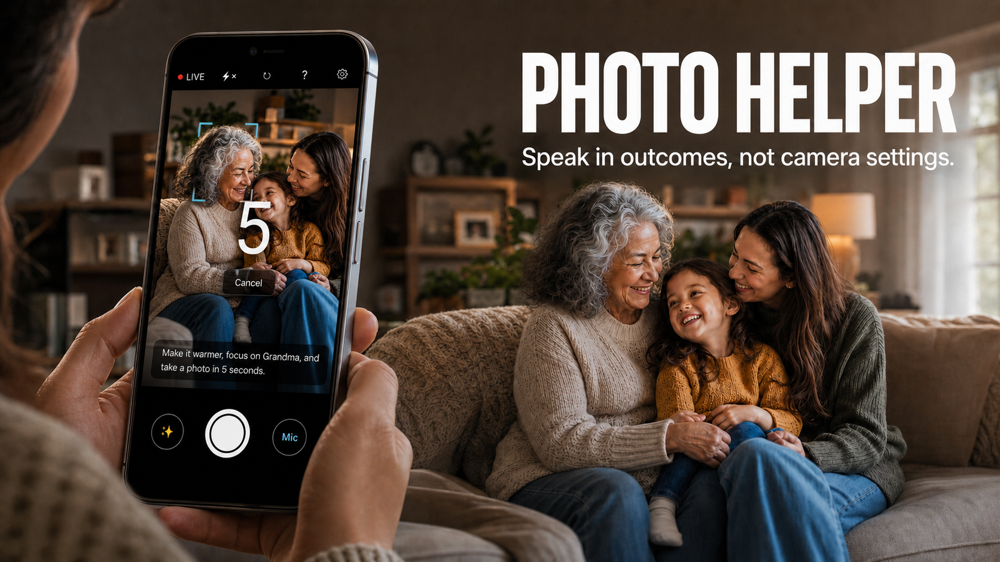

# Photo Helper — Submission Copy

This file follows the portal field order. Copy only the field contents into the submission form.

## 1. Project title

Photo Helper

## 2. Project image

Use `submission-assets/photo-helper-cover-16x9-v6-actual-ui.png`.

## 3. Short blurb

Speak in outcomes, not camera settings.

Word count: 6 (hard limit: under 10)

## 4. Project Description

### Project Overview: scenario, users, and value proposition

Photo Helper is a voice-first camera-control translator for casual smartphone photographers, especially elderlies and less tech-literate users. A user can say, “Make it brighter, focus on the person in red, and take a photo after three seconds.” The agent converts that outcome into a visible, bounded plan and operates supported zoom, exposure, white balance, camera selection, flash, focus, countdown, and capture controls on a real Android phone.

It is an agent—not a photography chatbot—because it closes an **observe → understand → plan → approve → act → verify or recover** loop. Android checks capabilities, seeks confirmation where appropriate, and retains Reset and fallback controls. Its value is safe translation and execution, not a claim of superior photographic taste.

### Real-World Scenario Insights: pain points, audience, and problem solved

People describe photos as “too dark,” “too warm,” “too far away,” or “not focused on Mum.” Cameras expose exposure compensation, zoom ratios, white-balance modes, focus regions, and timers. Translating between them creates cognitive load and missed moments, particularly for less-confident smartphone users. This is a product hypothesis based on task analysis and repeated physical-phone testing, not completed older-adult research. Therefore ambiguous or unsupported requests do not execute, stale plans are rejected, and ordinary capture remains usable without hosted AI.

### Comprehensive Solution Design

The prototype is a native Android app using Kotlin, Jetpack Compose, CameraX/Camera2, on-device speech recognition, and ML Kit. It works with existing phone hardware. The initial product is a voice-controlled utility for families and casual photographers; a production version would move model credentials behind a product-owned service and could expose the bounded planner as an OEM camera mode or SDK.

For each request, Photo Helper sends Qwen3.7 Flash the transcript, reduced clean and gridded frames, and trusted telemetry and capability bounds. Qwen returns a semantic plan but has no camera-control interface. Android reparses it, rejects invalid or stale context, maps semantic directions to values supported by the active lens, and alone acts on the camera. Settings run transactionally: failure restores the pre-Apply state; Reset restores the baseline across chained changes.

The prompt is a strict planning contract with at most eight ordered actions from six allowlisted types: `ADJUST`, `SET_CAMERA`, `SET_FLASH`, `FOCUS_CELL`, `RESET`, and `CAPTURE`. It forbids raw values, free-form coordinates, extra keys, and prose; visual focus is limited to a valid grid cell.

Voice is push-to-talk, capped at 15 seconds, transcribed on-device where supported, overwritten after use, and never sent to Alibaba. Hosted requests receive reduced still frames—not audio, continuous preview, or the full-resolution photo.

### Quantifiable Metrics and Defined Impact

- One request can produce **up to eight ordered actions** from **six allowlisted action types**.
- One Reset restores the original baseline across chained adjustments.
- Voice capture is limited to **15 seconds**, and hosted interpretation receives reduced still images rather than continuous video.

The intended impact is lower camera-control complexity: users state the outcome once, inspect the plan, and can reverse it. A production pilot should measure task completion, time-to-capture, manual interactions, retakes, and user confidence before broader accessibility or photo-quality claims.

## 5. Demo video

**URL:** `[ADD YOUTUBE OR GOOGLE DRIVE LINK AFTER UPLOAD]`

The recording plan is in `submission-assets/demo-video-plan.md`.

## 6. Product Sharing

I used WorkBuddy as a deliberate product-quality pipeline. I split the work into bounded, credit-efficient roles: HY3 handled repository-scale investigation and implementation, while Kimi-K3 was paired with WorkBuddy’s UI/UX expert for high-leverage product decisions and final visual judgment. WorkBuddy traced the real Android journey, produced an evidence-backed audit, edited approved Kotlin, Compose, test, and documentation files, ran Gradle checks, installed the APK, and operated a connected OnePlus through ADB. Its work changed the shipped product: voice guidance now matches the compact square Stop control, Reset remains available while an adjustment can still be reversed, and the final Reset treatment was corrected and verified through a deterministic **57/57 instrumented-test run on the physical phone**. I kept human approval between stages, rejected an unnecessary typed-input proposal and an overly textual microphone design, and returned focused corrections for implementation and re-verification. This taught me that WorkBuddy is most useful when it owns a clear review-to-verification loop and when every recommendation must earn acceptance through code, tests, or physical-device evidence.

## 7. Project link (optional bonus)

**URL:** `[ADD LIVE URL OR DOWNLOADABLE DEMO LINK IF AVAILABLE]`

## Portal metadata

- **Direction:** Life Agent
- **Product used:** WorkBuddy
- **Team name:** Fivecent
- **Team members:** Lu Bolin, Ethan Yap, Nathanael Leong
